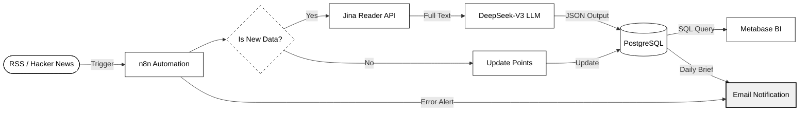

# AI 驱动的科技新闻系统


> **项目概述**：一个端到端的数据工程与商业智能解决方案。该系统旨在通过自动化流水线减轻科技行业的信息过载，实时采集 Hacker News 与 TechCrunch 的低结构化数据，利用大语言模型（LLM）进行结构化清洗与情感分析，最终通过交互式仪表盘与自动化日报为决策提供量化支持。

**[在线演示](https://dashboard.trainingcqy.com)** **[PDF演示]**(assets/docs/Metabase - 科技前沿.pdf)
---

## 1. 系统架构设计

本项目遵循 **ELT (Extract, Load, Transform)** 架构设计，已容器化，并部署到Azure虚拟机。


### 自动化编排逻辑

系统的核心逻辑由 n8n 可视化编排实现，包含**多源采集、条件分流、AI 语义分析**及**异常熔断**机制。

#### 主采集流水线 (Main)
> *集成了 RSS 轮询、Jina 全文解析与 DeepSeek 推理的完整链路。*


#### 异常捕获与告警 (Error)
> *独立的全局错误处理模块，负责拦截失败任务并触发邮件报警，写入系统日志。*


#### 自动化日报推送 (Brief)
> *每日基于 SQL 筛选出最新与最热新闻，渲染为 HTML 邮件推送.*

---

## 2. 核心实施阶段

### 2.1 数据采集与处理层
利用 **n8n** 作为工作流编排引擎，实现了数据获取的自动化与智能化。
*   **多源异构数据获取**：“构建了基于 HTTP Polling 的混合采集层，兼容 REST API (Hacker News) 与 RSS 订阅源 (TechCrunch)，实现了多源异构数据的统一接入。
*   **非结构化数据清洗**：集成 **Jina Reader** 将杂乱的 HTML 网页转换为干净的 Markdown 文本，提高 LLM 的准确率和效率。
*   **AI 语义增强**：调用 **DeepSeek-V3** 模型，对长文本进行 NLP 处理，输出标准化的 JSON 数据：
    *   **智能摘要**：生成字数限制下的高密度关键事实摘要。
    *   **情感量化**：自动标记新闻情感倾向（Positive/Neutral/Negative）。
    *   **自动分类**：基于内容上下文自动提取赛道标签（如 AI、商业、安全）。
    *   **成本控制**：采用 DeepSeek-V3 模型，在模型能力可接受的范围内，降低推理成本，实现了高性价比的文本清洗。

### 2.2 数据仓库与建模层
使用 **PostgreSQL 15** 作为核心数据仓库，通过分层设计保证数据的一致性与查询效率。
*   **Schema 设计**：设计了包含 `url` 唯一约束的表结构，有效防止数据冗余和重复抓取。
*   **视图抽象**：构建 `view_dashboard_news` 视图层，封装了底层逻辑：
    *   **时区标准化**：将 UTC 时间转换为 UTC+8（北京时间）。
    *   **数据去重**：基于 URL 自动归类去重。
    *   **CDC 支持**：配置了 `updated_at` 触发器，自动记录数据变更时间。

### 2.3 业务分析与算法层
本项目不仅仅是数据的展示，也包含了业务逻辑分析。核心算法包括：
*   **Hacker News 重力算法复刻**：
    *   逻辑：`Score = Points / (Time + 2)^1.8`
    *   价值：引入时间衰减因子，识别“当前上升速度最快”的热点，而非单纯的历史高分内容。
*   **赛道周环比增长**：
    *   逻辑：使用 CTE 与 Self-Join 技术。
    *   价值：量化不同技术赛道（如 AI ）的热度变化趋势，捕捉潜在的市场风口。
*   **巨头声量份额分析**：
    *   逻辑：使用 `UNION ALL` 解决多标签重叠统计问题。
    *   价值：计算 OpenAI、Google 等科技巨头的讨论热度与占比。

### 2.4 可视化与交互层
基于 **Metabase** 构建 BI 仪表盘，强调交互体验与信息分层。
*   **主从联动交互**：利用 SQL 变量注入技术 (`[[AND id = {{selected_id}}]]`)，实现了点击左侧列表标题，右侧详情卡片刷新摘要的功能。

### 2.5 自动化分发与可观测性
为了提升系统的稳定性和信息触达效率，构建了完整的主动推送机制。
*   **全链路异常捕获**：设计了全局错误捕获工作流。当 API 超时、解析失败或数据库写入错误时，自动捕获错误与节点信息。
*   **智能日报推送**：每天08:00基于 SQL 筛选出最新与最热新闻，渲染为 HTML 邮件自动发送。

---

## 3. 目录结构

项目采用标准的工程化目录结构，实现基础设施代码与业务逻辑分离。

```text
TechNews_Intelligence/
├── etl_workflow/                   # n8n 自动化工作流配置
│   ├── Tech_Intelligence.json      # 核心采集流程
│   ├── System_Alert_Service.json   # 异常捕获流程
│   └── Daily_Tech_Brief.json       # 日报推送流程
│
├── sql/
│   ├── infrastructure/        # DDL: 基础设施层 (建表与视图)
│   │   ├── _schema_ddl.sql    # 数据库表结构定义 (含 Trigger/Index)
│   │   └── _view_logic.sql    # 视图层逻辑 (时区转换、清洗、指标预计算)
│   │
│   └── analytics/                            # DML: 业务分析层 (Metabase 核心逻辑)
│       ├── _algo_gravity_ranking.sql         # HN 重力排名算法
│       ├── _analysis_category_growth.sql     # 赛道周环比增长率
│       ├── _analysis_heatmap.sql             # 黄金发布时间热力图
│       ├── _analysis_negativity_index.sql    # 赛道负面率/风险指数
│       ├── _analysis_source_bias.sql         # 媒体 vs 社区舆论温差
│       ├── _analysis_tech_giants_battle.sql  # 科技巨头声量份额
│       ├── _card_dynamic_summary.sql         # 动态摘要卡片
│       ├── _chart_engagement.sql             # 情绪与热度效能分析
│       ├── _chart_market_attention.sql       # 市场注意力分布
│       ├── _chart_sentiment_trend.sql        # 舆情分时趋势
│       ├── _chart_techcrunch_daily.sql       # 媒体日更趋势
│       ├── _table_community_hits.sql         # 社区热议
│       ├── _table_hackernews_top.sql         # Hacker News 热榜
│       └── _table_techcrunch_latest.sql      # TechCrunch 快讯
│
├── deployment/                  # Docker 配置文件、环境模板、Metabase示例
└── assets/                      # 项目文档截图
```

---

## 4. 本地部署

本项目完全容器化，支持一键部署。

### 前置条件
*   已安装 Docker
*   获取 DeepSeek API Key 及 Jina Reader API Key

### 克隆仓库
```bash
git clone https://github.com/Trainingdlu/TechNews_Intelligence.git
cd TechNews_Intelligence
```

### 环境配置
复制配置文件模板并根据运行环境更改。
*注意：`docker-compose.yml` 已配置为生产环境模式。*

```bash
cp deployment/.env.example deployment/.env
# 使用文本编辑器修改 .env 文件，填入你的数据库密码及 API Keys
```

### 启动服务
```bash
cd deployment
docker-compose up -d
```

### 导入工作流
1.  访问 `http://localhost:5678` 进入 n8n 管理界面。
2.  导入 `etl_workflow/` 中的文件。**重要**：在 n8n 界面中配置 PostgreSQL 凭证并添加 Gmail App Password 以启用日报和报警功能。
3.  激活工作流。

---

## 5. 许可协议与商业使用

本项目采用 **GNU AGPLv3** 开源协议。

---

## 6. 作者

**Trainingcqy** <br> [trainingcqy@gmail.com](mailto:trainingcqy@gmail.com)
