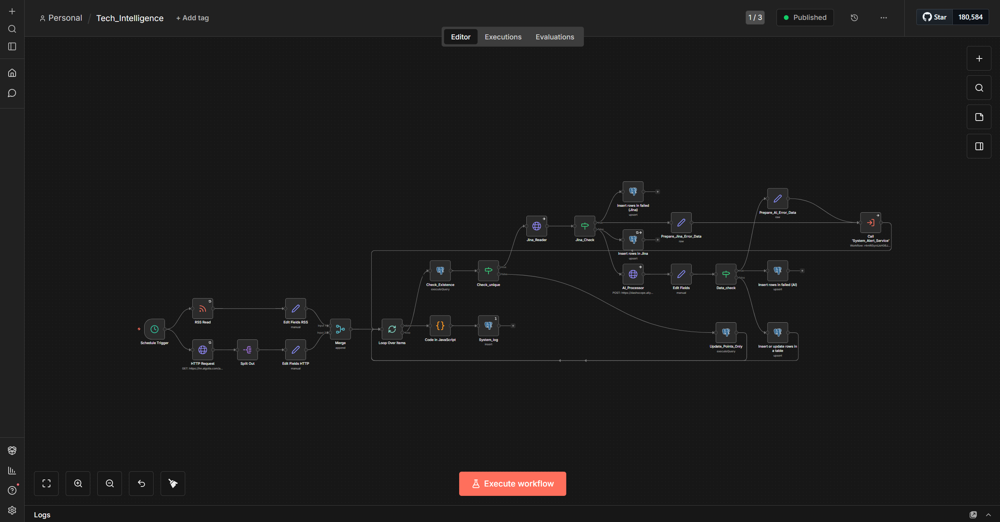
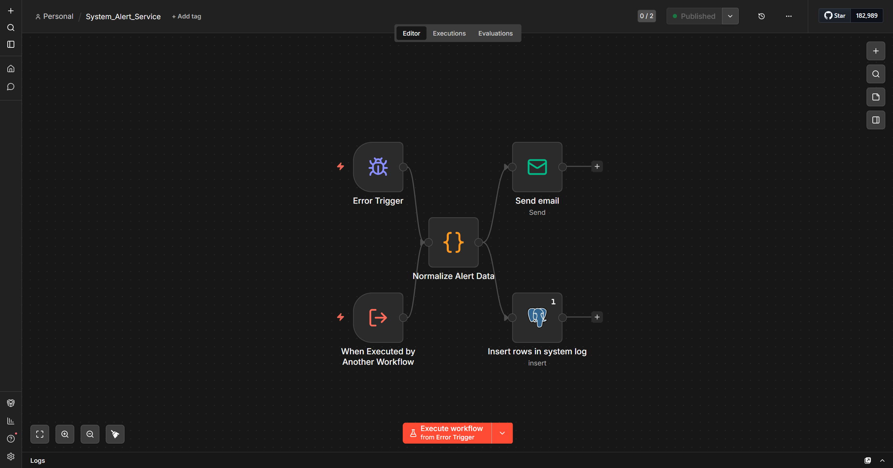
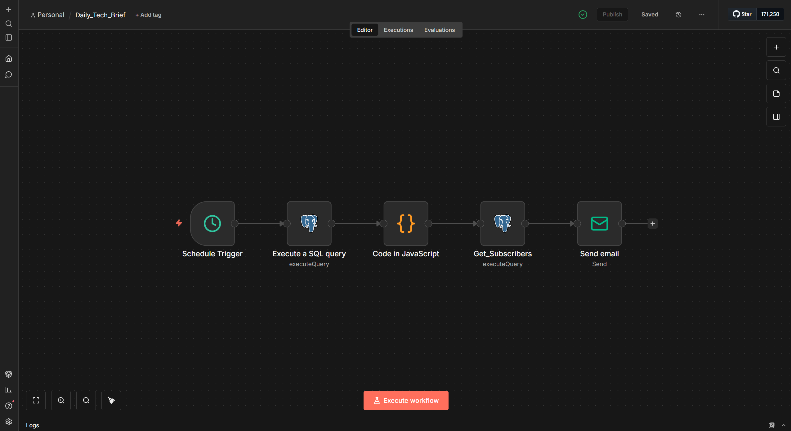

# TechNews Intelligence


> 定时采集 Hacker News 与 TechCrunch 的数据，通过 LLM 进行结构化处理（摘要、情感分析、分类），存入 PostgreSQL，并自动生成语义向量支持相似度搜索。最终通过 Metabase 仪表盘、邮件日报和 AI 深度分析 Agent 进行展示与交互。

**[在线演示](https://dashboard.trainingcqy.com)**　|　[PDF 示例](assets/docs/Metabase.pdf)

---

## 1. 系统架构

项目基于 **ELT** 架构，使用 Docker Compose 编排，包含四个核心服务：n8n（工作流与向量化）、PostgreSQL（存储与向量检索）、Metabase（可视化）、Telegram Bot（AI 分析 Agent 交互入口），同时提供本地 CLI 入口。



### 工作流概览

系统包含三条 n8n 工作流：

#### 主采集流水线 (Main)
> 每小时触发，采集数据后通过 Jina Reader 提取全文，再调用 LLM 输出结构化 JSON（翻译、摘要、情感、分类）。写入成功后自动调用 Jina Embeddings API 生成 1024 维语义向量并存入 `news_embeddings` 表，确保语义搜索始终覆盖最新数据。已有数据仅更新热度值。


#### 异常捕获与告警 (Error)
> 全局错误处理模块。当任务失败时，将错误信息写入 `system_logs` 表并发送告警邮件。


#### 日报推送 (Brief)
> 每日 08:00 触发，从数据库筛选近 24 小时的热门新闻，渲染为 HTML 邮件发送。


---

## 2. 功能说明

### 2.1 数据采集与处理

使用 n8n 编排数据获取流程：
*   **数据源接入**：通过 REST API 获取 Hacker News 数据，通过 RSS 订阅获取 TechCrunch 数据，合并后统一处理。
*   **全文提取**：使用 Jina Reader 将原始 HTML 页面转换为 Markdown 文本，作为 LLM 的输入。
*   **LLM 结构化处理**：对提取的文本调用 LLM，输出包含以下字段的 JSON：
    *   **中文标题**：附带分类标签（AI / 安全 / 硬件 / 开发 / 商业 / 生态）。
    *   **摘要**：提取关键事实，社区讨论类内容则归纳共识观点。
    *   **情感标注**：Positive / Neutral / Negative。
*   **数据校验**：对 LLM 输出进行多条件校验（空值、解析失败等），不合格数据写入死信队列。

### 2.2 数据库设计

使用 PostgreSQL 存储，主要包含以下表：

| 表名 | 用途 |
|------|------|
| `tech_news` | 主数据表，`url` 唯一约束防止重复 |
| `news_embeddings` | 语义向量表，存储 1024 维 Jina Embeddings，供 Agent 混合搜索 |
| `tech_news_failed` | 死信队列，记录处理失败的条目 |
| `jina_raw_logs` | Jina Reader 返回的原始内容 |
| `system_logs` | 系统运行日志 |

视图 `view_dashboard_news` 封装了以下逻辑：
*   UTC → UTC+8 时区转换
*   基于 URL 和 `source_id` 的来源分类（HackerNews / TechCrunch）
*   `hours_ago` 时间差计算
*   HackerNews 讨论页链接生成

`updated_at` 字段通过触发器自动更新。

### 2.3 分析查询

`sql/analytics/` 下包含 14 条 Metabase SQL 查询:

*   `_table_hackernews_top.sql`：**社区热议** - 按热度分布抓取 HackerNews Top15 热门话题。
*   `_table_techcrunch_latest.sql`：**实时快讯** - 按发布时间抓取 TechCrunch 的最新动态。
*   `_algo_gravity_ranking.sql`：**重力排名** - 复刻 HN 排名公式，展示上升最快的新闻。
*   `_card_dynamic_summary.sql`：**动态摘要卡片** - 配合 Metabase 参数传递，实现点击标题查看 AI 摘要。
*   `_chart_market_attention.sql`：**热门话题分类统计** - 各分类标签（如 AI、硬件）的发布数量与热度总量。
*   `_table_community_hits.sql`：**话题热度分布** - 结合时长、热度和情绪，散点化展示近期高热度讨论。
*   `_chart_sentiment_trend.sql`：**舆情分时趋势** - 展示最近三天情绪的变化。
*   `_chart_engagement.sql`：**情绪效能分析** - 统计不同情感对新闻传播热度的影响。
*   `_analysis_negativity_index.sql`：**负面率指数** - 各垂直赛道的负面新闻浓度。
*   `_analysis_heatmap.sql`：**发布热力图** - 展示热度最高的发帖时间。
*   `_analysis_category_growth.sql`：**赛道周环比** - CTE 与自连接计算各分类本周与上周的热度增量差。
*   `_analysis_tech_giants_battle.sql`：**巨头声量战** - 统计 Microsoft、OpenAI 等 10 家头部公司的热度。
*   `_analysis_source_bias.sql`：**来源情绪差异** - 体现技术社区 (HN) 与媒体机构 (TC) 的情绪倾向差异。
*   `_chart_techcrunch_daily.sql`：**媒体日更** - 统计 TechCrunch 每日发文量。

### 2.4 可视化与推送

*   **Metabase 仪表盘**：展示上述分析结果，支持点击标题查看摘要的主从联动交互。
*   **邮件日报**：每日早 8 点发送，包含 HackerNews Top 7 和 TechCrunch Top 7，支持订阅者管理。
*   **异常告警**：流程出错时自动发送告警邮件并记录日志。

### 2.5 AI 深度分析 Agent

基于 Gemini 2.5 Pro 的交互式分析 Agent，支持对库内新闻进行多轮对话式深度解读。提供两种接入方式：

*   **Telegram Bot**：通过 `bot.py` 部署为 Telegram 机器人，随 Docker Compose 自动启动，支持 MarkdownV2 富文本回复。按 `chat_id` 隔离对话历史，支持 `/start`、`/clear` 命令。
*   **本地 CLI**：通过 `cli.py` 在终端交互，适用于本地开发调试。

核心能力：

*   **混合搜索**：结合 Jina Embeddings 语义相似度与关键词精确匹配，自动合并去重，返回最相关的文章。
*   **全文深挖**：自动从 `jina_raw_logs` 提取新闻全文，基于全文而非摘要进行分析。
*   **时效感知**：Agent 在首次交互时主动获取数据库最新文章时间与近 21 天数据分布，标注数据截止时间。
*   **多轮上下文**：支持追问（如"再深入说说第二点"、"那它的竞争对手呢"），对话上下文自动保持。
*   **结构化输出**：输出格式包含核心事件、深度解读（技术趋势 / 竞争格局 / 商业影响等维度）和关键洞察。

---

## 3. 目录结构

```text
TechNews_Intelligence/
├── etl_workflow/                   # n8n 工作流配置
│   ├── Tech_Intelligence.json      # 主采集流程（含向量化节点）
│   ├── System_Alert_Service.json   # 异常捕获流程
│   └── Daily_Tech_Brief.json       # 日报推送流程
│
├── agents/                         # AI 深度分析 Agent
│   ├── db.py                       # 数据库连接池
│   ├── tools.py                    # Agent 工具函数（搜索、全文读取等）
│   ├── prompts.py                  # System Prompt 模板
│   ├── agent.py                    # LLM 客户端、Chat 工厂
│   ├── bot.py                      # Telegram Bot 入口（Docker 部署）
│   ├── cli.py                      # 本地终端交互入口
│   ├── requirements.txt            # Python 依赖
│   └── .env.example                # 环境变量模板
│
├── sql/
│   ├── infrastructure/             # DDL：建表与视图
│   │   ├── schema_ddl.sql         # 表结构定义（含 Trigger / Index）
│   │   └── view_logic.sql         # 视图逻辑（时区转换、来源分类、指标计算）
│   │
│   └── analytics/                  # DML：Metabase 分析查询
│       ├── algo_gravity_ranking.sql
│       ├── ...
│       └── table_techcrunch_latest.sql
│
├── deployment/                     # Docker 部署配置
│   ├── docker-compose.yml
│   └── .env.example
│
└── assets/
    ├── docs/                       # Metabase 仪表盘 PDF
    ├── screenshots/                # 工作流截图
    └── svg/                        # 架构图
```

---

## 4. 部署

项目已容器化，通过 Docker Compose 部署。

### 前置条件
*   已安装 Docker 与 Docker Compose
*   已获取 LLM API Key（阿里通义 / Gemini）及 Jina API Key
*   已创建 Telegram Bot 并获取 Bot Token（通过 [@BotFather](https://t.me/BotFather)）

### 步骤

```bash
# 1. 克隆仓库
git clone https://github.com/Trainingdlu/TechNews_Intelligence.git
cd TechNews_Intelligence

# 2. 配置环境变量
cp deployment/.env.example deployment/.env
# 编辑 deployment/.env，填入数据库密码、API Key 和 TELEGRAM_BOT_TOKEN

# 3. 启动服务
cd deployment
docker-compose up -d
```

### 导入工作流
1.  访问 `http://localhost:5678` 进入 n8n 管理界面。
2.  导入 `etl_workflow/` 目录下的三个 JSON 文件。
3.  在 n8n 中配置 PostgreSQL 连接凭证和 SMTP 凭证（用于邮件功能）。
4.  激活工作流。

### Telegram Bot

Bot 服务已包含在 `docker-compose.yml` 中，执行 `docker-compose up -d` 后会随其他服务一同启动，无需额外操作。

### 本地 CLI（可选）
```bash
cd agents
cp .env.example .env
# 编辑 .env，填入 Gemini API Key、Jina API Key、数据库连接信息
pip install -r requirements.txt
python cli.py
```

---

## 5. 开源协议

本项目采用 [GNU AGPLv3](LICENSE) 协议。

---

## 6. 作者

**Trainingcqy** · [trainingcqy@gmail.com](mailto:trainingcqy@gmail.com)
