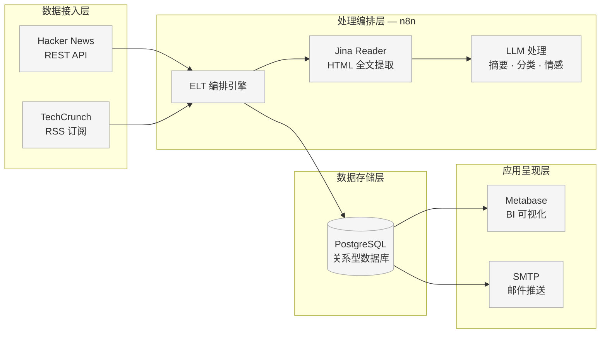

# TechNews Intelligence


> 定时采集 Hacker News 与 TechCrunch 的数据，通过 LLM 进行结构化处理（摘要、情感分析、分类），存入 PostgreSQL，最终通过 Metabase 仪表盘和邮件日报进行展示。

**[在线演示](https://dashboard.trainingcqy.com)**　|　[PDF 示例](assets/docs/Metabase.pdf)

---

## 1. 系统架构

项目基于 **ELT** 架构，使用 Docker Compose 编排，包含三个核心服务：n8n（工作流）、PostgreSQL（存储）、Metabase（可视化）。


```mermaid
flowchart LR
    subgraph Sources [数据接入层]
        HN[Hacker News<br/>REST API]
        TC[TechCrunch<br/>RSS 订阅]
    end

    subgraph Pipeline [处理编排层 — n8n]
        direction TB
        ELT[ELT 编排引擎]
        JINA[Jina Reader<br/>HTML 全文提取]
        LLM[LLM 处理<br/>摘要 · 分类 · 情感]
        ELT --> JINA --> LLM
    end

    subgraph Storage [数据存储层]
        PG[(PostgreSQL<br/>关系型数据库)]
    end

    subgraph Apps [应用呈现层]
        MB[Metabase<br/>BI 可视化]
        SMTP[SMTP<br/>邮件推送]
    end

    HN --> ELT
    TC --> ELT
    ELT --> PG
    PG --> MB
    PG --> SMTP

    classDef default fill:#f5f5f5,stroke:#aaa,stroke-width:1px,color:#333
    classDef container fill:#fafafa,stroke:#bbb
```

### 工作流概览

系统包含三条 n8n 工作流：

#### 主采集流水线 (Main)
> 每小时触发，采集数据后通过 Jina Reader 提取全文，再调用 LLM 输出结构化 JSON（翻译、摘要、情感、分类）。已有数据仅更新热度值。


#### 异常捕获与告警 (Error)
> 全局错误处理模块。当任务失败时，将错误信息写入 `system_logs` 表并发送告警邮件。


#### 日报推送 (Brief)
> 每日 08:00 触发，从数据库筛选近 24 小时的热门新闻，渲染为 HTML 邮件发送。


---

## 2. 功能说明

### 2.1 数据采集与处理

使用 n8n 编排数据获取流程：
*   **数据源接入**：通过 REST API 获取 Hacker News 数据，通过 RSS 订阅获取 TechCrunch 数据，合并后统一处理。
*   **全文提取**：使用 Jina Reader 将原始 HTML 页面转换为 Markdown 文本，作为 LLM 的输入。
*   **LLM 结构化处理**：对提取的文本调用 LLM，输出包含以下字段的 JSON：
    *   **中文标题**：附带分类标签（AI / 安全 / 硬件 / 开发 / 商业 / 生态）。
    *   **摘要**：提取关键事实，社区讨论类内容则归纳共识观点。
    *   **情感标注**：Positive / Neutral / Negative。
*   **数据校验**：对 LLM 输出进行多条件校验（空值、解析失败等），不合格数据写入死信队列。

### 2.2 数据库设计

使用 PostgreSQL 存储，主要包含以下表：

| 表名 | 用途 |
|------|------|
| `tech_news` | 主数据表，`url` 唯一约束防止重复 |
| `tech_news_failed` | 死信队列，记录处理失败的条目 |
| `jina_raw_logs` | Jina Reader 返回的原始内容 |
| `system_logs` | 系统运行日志 |

视图 `view_dashboard_news` 封装了以下逻辑：
*   UTC → UTC+8 时区转换
*   基于 URL 和 `source_id` 的来源分类（HackerNews / TechCrunch）
*   `hours_ago` 时间差计算
*   HackerNews 讨论页链接生成

`updated_at` 字段通过触发器自动更新。

### 2.3 分析查询

`sql/analytics/` 下包含 14 条 Metabase SQL 查询:

*   `_table_hackernews_top.sql`：**社区热议** - 按热度分布抓取 HackerNews Top15 热门话题。
*   `_table_techcrunch_latest.sql`：**实时快讯** - 按发布时间抓取 TechCrunch 的最新动态。
*   `_algo_gravity_ranking.sql`：**重力排名** - 复刻 HN 排名公式，展示上升最快的新闻。
*   `_card_dynamic_summary.sql`：**动态摘要卡片** - 配合 Metabase 参数传递，实现点击标题查看 AI 摘要。
*   `_chart_market_attention.sql`：**热门话题分类统计** - 各分类标签（如 AI、硬件）的发布数量与热度总量。
*   `_table_community_hits.sql`：**话题热度分布** - 结合时长、热度和情绪，散点化展示近期高热度讨论。
*   `_chart_sentiment_trend.sql`：**舆情分时趋势** - 展示最近三天情绪的变化。
*   `_chart_engagement.sql`：**情绪效能分析** - 统计不同情感对新闻传播热度的影响。
*   `_analysis_negativity_index.sql`：**负面率指数** - 各垂直赛道的负面新闻浓度。
*   `_analysis_heatmap.sql`：**发布热力图** - 展示热度最高的发帖时间。
*   `_analysis_category_growth.sql`：**赛道周环比** - CTE 与自连接计算各分类本周与上周的热度增量差。
*   `_analysis_tech_giants_battle.sql`：**巨头声量战** - 统计 Microsoft、OpenAI 等 10 家头部公司的热度。
*   `_analysis_source_bias.sql`：**来源情绪差异** - 体现技术社区 (HN) 与媒体机构 (TC) 的情绪倾向差异。
*   `_chart_techcrunch_daily.sql`：**媒体日更** - 统计 TechCrunch 每日发文量。

### 2.4 可视化与推送

*   **Metabase 仪表盘**：展示上述分析结果，支持点击标题查看摘要的主从联动交互。
*   **邮件日报**：每日早 8 点发送，包含 HackerNews Top 7 和 TechCrunch Top 7，支持订阅者管理。
*   **异常告警**：流程出错时自动发送告警邮件并记录日志。

---

## 3. 目录结构

```text
TechNews_Intelligence/
├── etl_workflow/                   # n8n 工作流配置
│   ├── Tech_Intelligence.json      # 主采集流程
│   ├── System_Alert_Service.json   # 异常捕获流程
│   └── Daily_Tech_Brief.json       # 日报推送流程
│
├── sql/
│   ├── infrastructure/             # DDL：建表与视图
│   │   ├── schema_ddl.sql         # 表结构定义（含 Trigger / Index）
│   │   └── view_logic.sql         # 视图逻辑（时区转换、来源分类、指标计算）
│   │
│   └── analytics/                  # DML：Metabase 分析查询
│       ├── algo_gravity_ranking.sql
│       ├── analysis_category_growth.sql
│       ├── analysis_heatmap.sql
│       ├── analysis_negativity_index.sql
│       ├── analysis_source_bias.sql
│       ├── analysis_tech_giants_battle.sql
│       ├── card_dynamic_summary.sql
│       ├── chart_engagement.sql
│       ├── chart_market_attention.sql
│       ├── chart_sentiment_trend.sql
│       ├── chart_techcrunch_daily.sql
│       ├── table_community_hits.sql
│       ├── table_hackernews_top.sql
│       └── table_techcrunch_latest.sql
│
├── deployment/                     # Docker 部署配置
│   ├── docker-compose.yml
│   └── .env.example
│
└── assets/
    ├── docs/                       # Metabase 仪表盘 PDF
    └── screenshots/                # 工作流截图
```

---

## 4. 部署

项目已容器化，通过 Docker Compose 部署。

### 前置条件
*   已安装 Docker 与 Docker Compose
*   已获取 LLM API Key 及 Jina Reader API Key

### 步骤

```bash
# 1. 克隆仓库
git clone https://github.com/Trainingdlu/TechNews_Intelligence.git
cd TechNews_Intelligence

# 2. 配置环境变量
cp deployment/.env.example deployment/.env
# 编辑 deployment/.env，填入数据库密码及 API Key

# 3. 启动服务
cd deployment
docker-compose up -d
```

### 导入工作流
1.  访问 `http://localhost:5678` 进入 n8n 管理界面。
2.  导入 `etl_workflow/` 目录下的三个 JSON 文件。
3.  在 n8n 中配置 PostgreSQL 连接凭证和 SMTP 凭证（用于邮件功能）。
4.  激活工作流。

---

## 5. 开源协议

本项目采用 [GNU AGPLv3](LICENSE) 协议。

---

## 6. 作者

**Trainingcqy** · [trainingcqy@gmail.com](mailto:trainingcqy@gmail.com)
