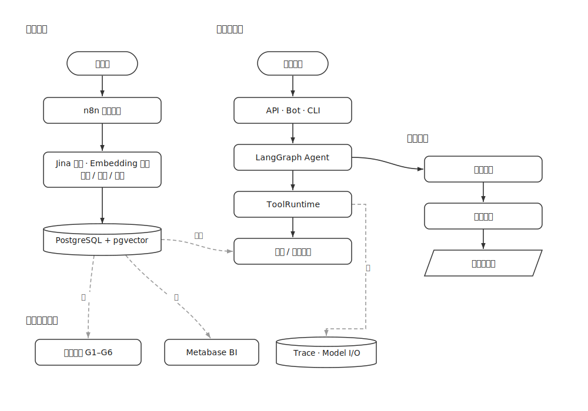
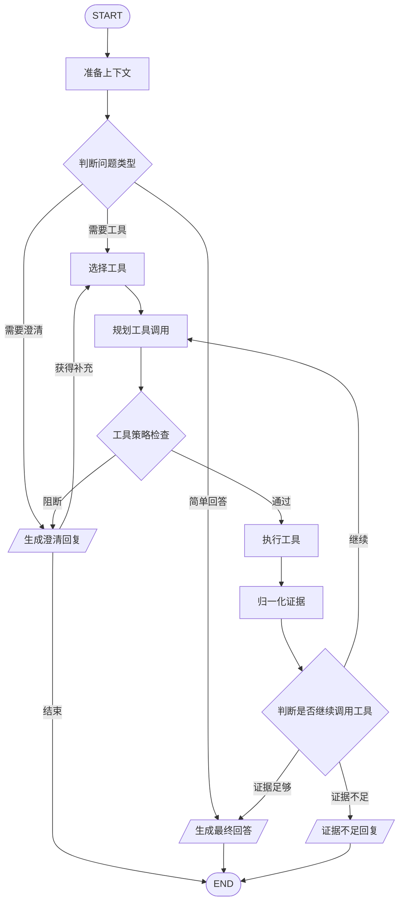

# 系统架构

TechNews Intelligence 由采集链路、存储层、Agent 运行时、交互入口、Trace 观测和离线评测组成。实时问答、Telegram Bot、本地 CLI 和评测脚本共用同一套 Agent 运行时。

## 总览

## 数据采集链路

n8n 工作流负责新闻采集、正文提取、结构化处理、向量生成和通知。采集链路写入 PostgreSQL，实时 Agent 只读取数据库和工具返回结果，不直接依赖 n8n 运行状态。

工作流文件：

| 文件 | 职责 | 主要输出 |
| --- | --- | --- |
| `etl_workflow/Tech_Intelligence.json` | 主采集链路，定时拉取新闻、提取正文、结构化处理和向量写入。 | `tech_news`, `jina_raw_logs`, `news_embeddings` |
| `etl_workflow/System_Alert_Service.json` | 全局异常捕获和质量告警。 | `system_logs`, 告警邮件 |
| `etl_workflow/Daily_Tech_Brief.json` | 每日简报生成和订阅推送。 | HTML 邮件，订阅推送记录 |

采集链路只负责事实数据和派生字段入库，不承担实时问答逻辑。Agent 查询时通过工具读取 PostgreSQL 和全文缓存；n8n 宕机不会影响既有数据的问答，只会影响后续增量更新。

主要数据表：

| 领域 | 表 |
| --- | --- |
| 新闻内容 | `tech_news`, `news_embeddings`, `jina_raw_logs` |
| 来源与实体 | `source_registry`, `entity_registry`, `entity_alias`, `entity_alias_candidate`, `news_entity_mentions` |
| 订阅与访问 | `subscribers`, `access_tokens`, `system_logs` |
| 对话 | `conversation_threads`, `conversation_messages` |
| 记忆 | `thread_memory_summaries`, `thread_evidence_index` |
| Trace | `agent_runs`, `agent_trace_spans`, `agent_model_io` |

数据库启用 `vector` 和 `pg_trgm` 扩展。结构由 `sql/infrastructure/schema/schema_ddl.sql` 管理，Metabase 和分析 SQL 使用 `view_dashboard_news` 作为统一视图。

数据层约定：

- `tech_news.url` 是新闻去重和跨表关联的主业务键。
- `jina_raw_logs` 保存 Jina Reader 原文缓存，供 `read_news_content` 和 `fulltext_batch` 读取。
- `news_embeddings` 与 `tech_news` 按 URL 关联，向量检索只作为候选召回来源，最终回答仍需证据归一。
- `view_dashboard_news` 统一处理北京时间、来源归一、hours_ago 和 HN 讨论链接，分析查询不重复实现这些规则。
- `agent_model_io` 可能包含完整模型输入输出，只通过 Trace Console 和受控脚本读取，不作为常规业务接口返回。

## Agent Graph

Agent 使用 LangGraph StateGraph 组织执行链路。节点名称在 Trace Console 中以中文展示，底层状态由 `AgentGraphState` 传递。

核心节点：

| 节点 | 内部名 | 职责 |
| --- | --- | --- |
| 准备上下文 | `prepare_context` | 构建历史索引、读取线程记忆、生成 Context Pack 和模型输入上下文。 |
| 判断问题类型 | `intent_router` | 判断简单问答、需要澄清、需要调用工具等执行路径。 |
| 选择工具 | `tool_selection` | 根据意图和上下文选择候选工具集合。 |
| 规划工具调用 | `tool_worker` | 生成具体工具调用计划和参数；循环补充检索时会复用上游待执行调用。 |
| 工具策略检查 | `tool_policy` | 检查工具名、数量、重复调用、参数范围和 URL 上下文；失败时转入澄清分支。 |
| 执行工具 | `tool_executor` | 通过 ToolRuntime 调用工具并返回 ToolEnvelope，同时累积证据 URL。 |
| 归一化证据 | `evidence_normalizer` | 合并工具证据、提取 URL、生成 evidence brief。 |
| 判断是否继续调用工具 | `tool_loop_decider` | 判断是否需要继续读取全文/补充检索、是否证据足够，或进入证据不足回复。 |
| 生成最终回答 | `final_synthesizer` | 基于工具结果、证据和 Context Pack 生成最终回答，并输出可引用 URL 集合。 |
| 生成澄清回复 | `clarification_response` | 生成澄清问题；启用 Postgres checkpointer 时可通过 LangGraph interrupt/resume 收集补充信息后继续工具链。 |
| 证据不足回复 | `insufficient_evidence_response` | 在检索后仍无足够证据时返回保守答复。 |

输出 URL 检查、正文引用校验和来源列表装饰在 `agent/agent.py` 的图后 guard/decorator 阶段执行，不是独立的 StateGraph 节点。

模型角色：

| 角色 | 默认职责 | 默认提供方 |
| --- | --- | --- |
| Intent | 判断问题类型、是否需要澄清、是否需要工具。 | DeepSeek |
| Tool | 生成结构化 tool calls，不直接输出最终答案。 | DeepSeek |
| Final | 基于工具结果和 evidence brief 生成最终回答。 | Vertex (Gemini) |
| Context | 整理历史、生成 Context Pack（可选，默认开启）。 | DeepSeek |

运行边界：

- 图节点只传递结构化 `AgentGraphState`，不直接操作数据库。
- 工具调用必须先经过图内策略检查，再进入 `ToolRuntime`。
- URL 型工具只能读取用户问题、历史上下文或前序工具证据中出现过的 URL。
- 最终回答的来源列表只能来自 `ToolEnvelope.evidence` 和 Context Pack 中已展示的历史证据 URL；图后输出守卫会拦截非证据 URL，并装饰来源列表。
- 当证据不足、范围模糊或来源冲突时，图进入澄清路径，而不是强行生成确定性结论。

## 上下文记忆

系统使用 Context Pack 和 Thread Memory 处理多轮对话。

Context Pack 在请求内生成，包含：

- 当前用户问题。
- 上下文整理后的独立问题。
- 与当前问题相关的历史轮次。
- 被选中的历史证据 URL。
- 线程级摘要和历史证据索引。
- 裁剪策略、选中数量和整理模型置信度。

Thread Memory 在回答持久化后异步更新，存储：

- `thread_memory_summaries`：线程摘要、主题、实体、已确认事实、待澄清问题。
- `thread_evidence_index`：历史回答中出现过的证据 URL、标题、摘要和来源序号。

Context Curator 是可选的上下文整理模型，默认开启。它只能从历史索引和线程证据索引中选择已有轮次和 URL，不能向主 Agent 注入伪造证据。确定性回退会保留最近对话和已有证据。

## 工具体系

工具定义、校验、执行和结果格式由 ToolRuntime 体系统一管理。

| 组件 | 职责 |
| --- | --- |
| `ToolCatalog` | 定义工具元数据、描述和输入契约。 |
| `ToolRegistry` | 绑定工具名、Pydantic schema 和处理器。 |
| `ToolRuntime` | 执行工具、调用 hooks、生成 tool_call span。 |
| `ToolRuntimeHooks` | 记录执行前后指标和诊断信息。 |
| `ToolEnvelope` | 统一工具返回结构。 |

`ToolEnvelope` 结构包含：

- `tool`
- `status`
- `request`
- `data`
- `evidence`
- `diagnostics`
- `error_code`
- `error`

工具参数校验分两层：

- 图内策略检查负责模型规划结果的业务拦截，例如候选工具限制、重复调用、URL 是否来自上下文。
- ToolRegistry 使用 Pydantic schema 执行硬校验，保证进入工具处理器的参数结构正确。

当前工具清单：

| 工具 | 用途 |
| --- | --- |
| `search_news` | 三路混合检索：词法 + pgvector 语义 + 实体别名精确，RRF 融合，叠加热度与时间衰减。 |
| `query_news` | 结构化新闻查询，支持来源、分类、情绪、时间窗口和排序。 |
| `trend_analysis` | 对比近 N 天与前 N 天的数据量和热度变化。 |
| `compare_sources` | 对比 Hacker News、TechCrunch 和官方来源的覆盖与情绪差异。 |
| `compare_topics` | 对比两个实体或主题的新闻量、热度、证据和差异判断。 |
| `build_timeline` | 将事件按时间排序，自动扩展窗口补齐关键节点。 |
| `analyze_landscape` | 从实体、信号类型和生态位角度分析竞争格局。 |
| `fulltext_batch` | 批量读取全文，适合深度分析和证据补充。 |
| `read_news_content` | 读取单篇新闻原文，URL 必须来自用户或已有证据。 |
| `fetch_external_url` | 读取新闻库之外的用户提供外部 URL 正文，经外部 fetch MCP 获取。 |
| `get_db_stats` | 返回数据库新鲜度、文章总量和基础状态。 |
| `list_topics` | 返回近 21 天发文量与分类（6 标签）占比。 |

检索策略：

- `search_news` 的统一检索核心 `fetch_hybrid_rows`（`agent/tools/hybrid_retrieval.py`）在单条 SQL 内做三路召回并用 RRF 融合（`RRF_K = 60`）：
    - 词法（lexical）：`news_search_index` 上的 Postgres 全文检索（`websearch_to_tsquery` 的 english + simple 配置），按 `ts_rank_cd` 排序。
    - 语义（semantic）：pgvector 余弦距离（`<=>`）召回；无查询向量时自动跳过该路。
    - 精确（exact）：用 `entity_alias` 把查询扩展为实体别名词项，在标题/摘要上做 ILIKE 子串匹配和 pg_trgm 三元组相似度匹配，兜底公司名、产品名等专有名词。
- 三路各自排名后按带权 RRF（`weight / (RRF_K + rank)`）求和、按 URL 合并去重；时间衰减和热度归一化只影响排序，不改变证据来源。
- Jina Reranker 由 `NEWS_RERANK_MODE` 控制，失败时保留原召回顺序。
- 下游工具如 `compare_topics`、`build_timeline`、`analyze_landscape` 会复用统一的召回和 rerank 辅助逻辑，避免每个工具各自实现排序规则。

## Trace 与观测

项目内 Trace 是主观测链路，独立写入 PostgreSQL。LangSmith 是可选外部观测扩展，不是自研 Trace 的依赖。

| 表 | 内容 |
| --- | --- |
| `agent_runs` | 请求级摘要：状态、耗时、用户问题、工具链、证据数量、token usage、运行时元数据。 |
| `agent_trace_spans` | 执行链路：流程节点、模型调用、工具执行、策略检查、后处理、上下文整理。 |
| `agent_model_io` | 完整模型输入 messages、原始输出、解析结果和 token usage。 |

span 类型：

| 类型 | 含义 |
| --- | --- |
| `graph_node` | LangGraph 流程节点。 |
| `context` | 上下文索引和 Context Pack 生成。 |
| `model_call` | 模型调用。 |
| `tool_call` | 工具执行。 |
| `guard` | 策略检查或澄清触发。 |
| `postprocess` | 证据归一、证据摘要等后处理。 |

Trace Console 读取这些表并展示请求列表、调用链、节点详情、完整模型输入输出、工具返回、错误信息和 raw JSON。

## 交互入口

| 入口 | 实现 | 说明 |
| --- | --- | --- |
| Web/API | `app/api.py` | Token 校验、限流、额度、对话线程、流式事件。 |
| Trace Console | `app/trace_api.py` + `trace_dashboard/` | 管理员 token 访问链路追踪面板。 |
| Telegram Bot | `app/bot.py` | Telegram 对话入口，按 chat_id 维护会话。 |
| CLI | `app/cli.py` | 本地命令行入口。 |
| MCP | `agent/mcp/stdio_server.py` | MCP stdio 服务边界。 |

## 工程文件映射

| 目录/文件 | 内容 |
| --- | --- |
| `agent/graph/` | StateGraph 节点、路由、模型角色和流式事件。 |
| `agent/core/tool_catalog.py` | 工具目录和工具元数据。 |
| `agent/core/tool_runtime.py` | 工具统一执行边界和 tool span 生成。 |
| `agent/core/tool_runtime_hooks.py` | 参数守卫和证据完整性审计。 |
| `agent/core/evidence.py` | 引用编号、来源列表和 URL 清理。 |
| `agent/core/trace.py` | 请求 Trace、span、模型 I/O 和运行时元数据。 |
| `services/agent_trace_store.py` | Trace 持久化到 PostgreSQL。 |
| `services/thread_memory.py` | 线程摘要和历史证据索引。 |
| `app/api.py` | Web/API、流式输出、token 配额和订阅接口。 |
| `app/trace_api.py` | Trace Console 后端 API。 |
| `trace_dashboard/` | Trace Console 前端。 |
| `eval/` | 离线评测、矩阵实验、评分和报告。 |

## LangSmith

LangSmith 通过 `LANGSMITH_*` 和 `LANGCHAIN_*` 环境变量启用。系统在 `agent_runs.trace_payload.runtime.langsmith` 中记录 LangSmith 状态、project 和 endpoint。自研 Trace 不依赖 LangSmith run id；后续可在可获取 run id 时写入 runtime 元数据。
