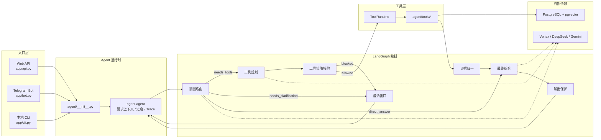
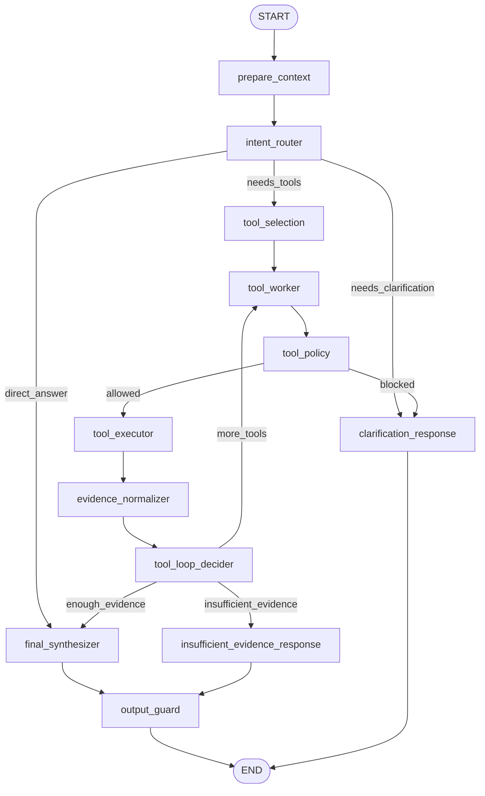
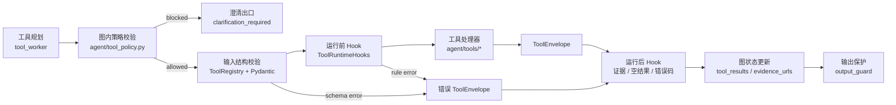

# TechNews Intelligence 架构

## 1. 系统总览

TechNews Intelligence 是一个围绕科技新闻数据构建的情报系统，核心能力包括新闻采集、结构化存储、混合检索、Agent 分析、Web/Telegram 交互、订阅通知和离线评估。

系统主要由四条链路组成：

- 数据采集链路：`n8n` 工作流采集新闻、正文、摘要、指标和向量数据，并写入 PostgreSQL。
- 实时问答链路：Web API、Telegram Bot 和本地 CLI 共同调用同一个 Agent 运行时。
- 检索分析链路：Agent 通过统一工具运行时访问新闻库、全文、混合检索、趋势、对比和时间线工具。
- 评估验证链路：`eval/` 生成任务数据集，运行 Agent，计算分层评分，并生成矩阵评估和排行报告。

```mermaid
flowchart LR
    frontend["静态前端<br/>frontend/*"] --> api["FastAPI<br/>app/api.py"]
    telegram["Telegram"] --> bot["Bot<br/>app/bot.py"]
    cli["本地 CLI<br/>app/cli.py"] --> facade["Agent 门面<br/>agent/__init__.py"]

    api --> facade
    bot --> facade
    facade --> runtime["Agent 运行时<br/>agent/agent.py"]
    runtime --> graph["LangGraph 编排<br/>agent/graph/*"]
    graph --> toolRuntime["工具运行时<br/>agent/core/tool_runtime.py"]
    toolRuntime --> tools["工具实现<br/>agent/tools/*"]
    tools --> db["PostgreSQL + pgvector"]
    graph --> llm["Gemini / Vertex / DeepSeek"]

    n8n["n8n 工作流<br/>etl_workflow/*.json"] --> db
    eval["离线评估<br/>eval/*"] --> facade
    services["公共服务<br/>services/*"] --> db
    api --> services
    bot --> services
```

## 2. 仓库边界

| 路径 | 运行职责 |
| --- | --- |
| `app/` | 入口层：FastAPI、Telegram Bot、本地 CLI。 |
| `agent/` | Agent 门面、LangGraph 运行时、工具执行、提示词、澄清逻辑、MCP 适配。 |
| `services/` | 公共服务层：数据库连接池、会话持久化、Trace 持久化、邮件、模型工厂。 |
| `agent/tools/` | 新闻检索、全文读取、趋势、对比、时间线、行业格局等具体工具。 |
| `sql/infrastructure/` | 数据库结构、视图、检查 SQL、种子数据。 |
| `sql/analytics/` | Metabase 和分析看板查询 SQL。 |
| `etl_workflow/` | n8n 工作流导出文件。 |
| `frontend/` | 静态聊天页和订阅页。 |
| `eval/` | 数据集生成、任务评估、矩阵运行、排行和报告生成。 |
| `deployment/` | Docker Compose、环境变量模板、数据库脚本、评估脚本。 |
| `tests/` | 单元测试和测试辅助代码。 |
| `assets/` | README 展示图、截图和 SVG 资源。 |

以下目录和文件属于本地运行产物，不属于源码架构：`.venv/`、`__pycache__/`、`.ruff_cache/`、`.codex-ui-check/`、`deployment/data/`、`eval/reports/*`、`eval/datasets/versions/v*/`。

## 3. 对外入口

### 3.1 Web API

`app/api.py` 是 Web API 入口。它创建 FastAPI 应用，配置 CORS，并在生命周期钩子中初始化和关闭 PostgreSQL 连接池。

主要接口：

| 接口 | 用途 |
| --- | --- |
| `GET /health` | 基础健康检查。 |
| `POST /request-access` | 创建或重发访问 Token，并通过邮件发送给用户。 |
| `GET /quota/{token}` | 查询 Token 的额度、已用次数、剩余额度和状态。 |
| `POST /chat` | 非流式认证聊天接口。 |
| `POST /chat-stream` | SSE 流式聊天接口，输出进度、证据和最终结果。 |
| `GET /subscription-options` | 返回可订阅来源和默认订阅配置。 |
| `GET /subscriptions` | 读取订阅配置。 |
| `POST /subscriptions` | 新建或更新日报订阅配置。 |
| `POST /subscriptions/unsubscribe` | 取消订阅。 |
| `GET /approve/{record_id}` | 打开带签名的管理员额度审批页。 |
| `POST /approve/{record_id}` | 执行额度审批。 |

API 层负责 Token 校验、IP 限流、额度预占与退款、请求 ID、会话线程创建、历史加载，以及用户和模型消息持久化。真正的回答生成交给 `agent.generate_response_payload`。

### 3.2 Telegram Bot

`app/bot.py` 使用 `python-telegram-bot`。Bot 按 `chat_id` 维护带 TTL 的会话缓存，并调用 `agent.generate_response_payload` 生成回答。

已注册命令：

- `/start`
- `/menu`
- `/whoami`
- `/status`
- `/settings`
- `/quota`
- `/clear`
- `/help`

Bot 还负责单聊限流、管理员校验、消息发送重试、来源链接渲染，以及关闭时释放数据库连接池。

### 3.3 本地 CLI

`app/cli.py` 是本地交互入口。它加载 `agent/.env`，通过 `agent.create_agent_chat()` 创建带历史的会话对象，循环读取用户输入，并在退出时关闭数据库连接池。

## 4. Agent 运行时

`agent/__init__.py` 是对外门面，导出实时和评估共用的接口：

- `generate_response`
- `generate_response_payload`
- `generate_response_eval_payload`
- `create_agent_chat`
- `init_db_pool`
- `close_db_pool`
- `get_last_tool_calls_snapshot`
- `get_route_metrics_snapshot`
- `reset_route_metrics`

`agent/agent.py` 是业务运行时包装层，职责包括：

- 创建请求级 Trace 上下文。
- 创建请求级进度回调上下文。
- 调用 `agent.graph.builder.invoke_custom_graph`。
- 处理澄清问题。
- 阻断无证据回答。
- 执行范围冲突和来源冲突检查。
- 校验最终输出中的 URL 是否来自有效证据。
- 规范化引用和来源区块。
- 生成 Web、Bot、评估三种不同形态的返回负载。

实时请求可以按下图阅读：



一次请求的主要状态流：

| 阶段 | 输入 | 输出 | 关键位置 |
| --- | --- | --- | --- |
| 入口归一 | Web、Bot 或 CLI 的用户消息、历史消息、线程信息 | `history`、`message`、`request_id`、`thread_id` | `app/api.py`、`app/bot.py`、`app/cli.py` |
| 请求上下文 | 归一化后的请求参数 | Trace 上下文、进度回调上下文 | `agent/agent.py`、`agent/core/trace.py`、`agent/core/run_context.py` |
| 图状态初始化 | 用户消息和历史消息 | `AgentGraphState` 初始状态 | `agent/graph/builder.py`、`agent/graph/state.py` |
| 图编排 | `AgentGraphState` | 意图、候选工具、工具结果、证据 URL、最终文本或澄清问题 | `agent/graph/nodes.py`、`agent/graph/routing.py` |
| 工具执行 | 工具名和参数 | `ToolEnvelope`、证据 URL、诊断信息 | `agent/core/tool_runtime.py`、`agent/tools/*` |
| 输出保护 | 草稿回答和有效证据 URL | 删除未知 URL 后的回答、`valid_urls` | `agent/graph/nodes.py`、`agent/agent.py` |
| 返回负载 | 最终文本、证据、澄清状态、Trace 摘要 | Web/Bot/评估各自需要的结构 | `generate_response_payload`、`generate_response_eval_payload` |

`agent.agent` 不直接承担检索和分析逻辑，它负责把外部入口转成同一套运行时协议，并在图执行前后处理跨入口的一致行为。实时链路会触发进度事件，评估链路会额外保留工具调用顺序、有效 URL 和可选 Trace 摘要。

Trace 会记录五类关键 span：

| Span 类型 | 记录内容 | 用途 |
| --- | --- | --- |
| `graph_node` | 每个图节点的输入摘要和输出摘要 | 还原一次请求经过了哪些节点。 |
| `model_call` | 调用模型的节点、提供方、模型名、token 使用量、可选完整输入输出 | 分析模型决策和成本。 |
| `tool_call` | 工具名、参数摘要、状态、证据 URL、诊断信息 | 对齐工具路径和检索证据。 |
| `guard` | 工具策略、澄清、保护逻辑的通过或阻断结果 | 定位请求为什么被澄清或阻断。 |
| `postprocess` | 证据归一、输出 URL 保护等后处理结果 | 检查最终回答是否仍被证据约束。 |

## 5. LangGraph 编排

`agent/graph/builder.py` 使用 `StateGraph(AgentGraphState)` 构建自定义图。状态结构定义在 `agent/graph/state.py`。

`AgentGraphState` 是图内唯一共享状态，主要字段如下：

| 字段 | 含义 |
| --- | --- |
| `user_message`、`history`、`llm_input_messages` | 当前输入、持久化历史和裁剪后的模型上下文。 |
| `intent` | 意图路由结果，决定直接回答、澄清还是调用工具。 |
| `selected_tools` | 当前意图允许使用的候选工具集合。 |
| `pending_tool_calls` | 工具规划节点产生、尚未执行的工具调用。 |
| `tool_results` | 已执行工具返回的 `ToolEnvelope` 列表。 |
| `tool_round`、`max_tool_rounds` | 工具循环轮次控制，默认最多两轮。 |
| `evidence_urls`、`evidence_brief`、`valid_urls` | 工具证据 URL、证据摘要和最终允许出现在回答中的 URL。 |
| `clarification`、`error`、`next_step` | 澄清负载、错误状态和路由节点的下一步决策。 |

当前节点拓扑：



节点职责：

| 节点 | 职责 |
| --- | --- |
| `prepare_context` | 把持久化历史转换为 LangChain 消息，并应用记忆策略。 |
| `intent_router` | 结合规则意图和可选模型 JSON 输出，决定请求路由。 |
| `tool_selection` | 根据意图类型选择候选工具。 |
| `tool_worker` | 使用工具规划模型生成工具调用；失败时走确定性规则回退。 |
| `tool_policy` | 根据候选工具、输入 schema、已有证据和策略校验待执行工具调用。 |
| `tool_executor` | 通过 `ToolRuntime` 执行工具并收集证据 URL。 |
| `evidence_normalizer` | 去重证据 URL，并生成证据摘要。 |
| `tool_loop_decider` | 判断是否继续调用工具、进入最终综合，或返回证据不足。 |
| `final_synthesizer` | 基于工具结果和证据摘要生成最终回答。 |
| `output_guard` | 移除未知 URL，并在需要时保证正文包含有效证据 URL。 |
| `clarification_response` | 返回结构化澄清问题。 |
| `insufficient_evidence_response` | 返回证据不足说明，再交给输出保护节点处理。 |

图内有三类确定性出口：

| 出口 | 触发条件 | 返回行为 |
| --- | --- | --- |
| 澄清 | 意图本身不完整，或 `tool_policy` 判断待执行工具不安全。 | 返回 `clarification_required` 结构，并带上澄清问题。 |
| 证据不足 | 需要证据的请求在检索和补救检索后仍没有有效 URL。 | 返回证据不足说明，不生成无来源分析。 |
| 正常回答 | 工具证据足够，或请求可以直接回答。 | 进入最终综合，再由 `output_guard` 处理 URL。 |

工具循环不是无限重试。`tool_loop_decider` 会优先检查是否已有证据；如果检索为空，会尝试使用规则生成补救调用；如果已有搜索证据且还没达到最大轮次，会为部分场景补充全文读取。达到轮次上限后，图会转向最终综合或证据不足出口。

图内模型由 `agent/graph/models.py` 构建。默认角色配置：

| 角色 | 默认提供方 | 默认模型来源 |
| --- | --- | --- |
| `intent` | Vertex | `DEFAULT_VERTEX_MODEL` |
| `tool` | DeepSeek | `DEFAULT_DEEPSEEK_MODEL` |
| `final` | Vertex | `DEFAULT_VERTEX_MODEL` |

角色模型可以通过 `AGENT_GRAPH_<ROLE>_PROVIDER`、`AGENT_GRAPH_<ROLE>_MODEL`、`AGENT_GRAPH_<ROLE>_TEMPERATURE` 覆盖。角色模型创建失败时，会尝试回退到默认 Agent 模型配置；如果仍不可用，节点会记录缺失客户端，并依赖规则回退继续运行。

## 6. 工具运行时

工具系统只有一条规范执行路径：

```text
ToolCatalog -> ToolRegistry -> ToolRuntime -> ToolEnvelope
```

关键文件：

| 文件 | 职责 |
| --- | --- |
| `agent/core/tool_catalog.py` | 工具元数据和处理器注册的唯一来源。 |
| `agent/core/tool_registry.py` | 使用 Pydantic 校验输入，并分发到工具处理器。 |
| `agent/core/tool_runtime.py` | 工具执行边界，负责 Trace、Hook、进度事件和证据累积。 |
| `agent/core/tool_runtime_hooks.py` | 工具执行前后保护逻辑。 |
| `agent/core/tool_contracts.py` | `ToolEnvelope` 和 `ToolEvidence` 结构定义。 |
| `agent/tools/schemas.py` | 所有工具的 Pydantic 输入结构。 |



工具调用经过六层校验和保护：

| 层级 | 关键逻辑 | 失败出口 |
| --- | --- | --- |
| 图内策略校验 | `evaluate_pending_tool_calls` 检查待执行工具数量、工具名是否在候选集合内、同批重复次数、参数是否为对象、schema 必填项、字符串最小长度、数值上下界、全文批量 URL 数量、`read_news_content` 的 URL 是否来自已有证据或用户输入、单次请求内重复调用次数。 | `tool_policy` 写入 `guard` span，并转成澄清问题。 |
| 输入结构校验 | `ToolRegistry` 使用 `agent/tools/schemas.py` 中的 Pydantic 模型解析参数。 | 返回错误 `ToolEnvelope`。 |
| 运行前 Hook | `ToolRuntimeHooks` 检查时间窗口、趋势窗口、对比主题是否相同、时间线主题是否为空等运行规则。 | 返回错误 `ToolEnvelope`，不会进入工具处理器。 |
| 工具处理器 | `agent/tools/*` 执行 SQL、向量检索、全文读取、趋势或对比分析。 | 处理器负责返回成功、空结果或错误 envelope。 |
| 运行后 Hook | 检查需要证据的工具是否缺少 URL、空结果是否缺少 `empty_reason`、错误结果是否缺少 `error_code`。 | 写入诊断告警，保留 envelope 结构。 |
| 输出保护 | `output_guard` 移除最终回答中没有出现在有效证据集合内的 URL。 | 回答仍返回，但未知 URL 不会保留。 |

图内策略的主要阻断原因包括：

| 原因 | 含义 |
| --- | --- |
| `too_many_pending_tool_calls` | 单批工具调用超过 `AGENT_TOOL_MAX_PENDING_CALLS`，默认 6。 |
| `tool_not_selected` | 模型规划了当前意图不允许使用的工具。 |
| `too_many_same_tool_calls` | 同一批中过多重复调用同一工具，阈值来自 `AGENT_TOOL_MAX_SAME_TOOL_PENDING`。 |
| `tool_arg_missing_required` | 参数缺少 schema 必填字段。 |
| `tool_arg_too_short` | 字符串参数不满足 schema 的最短长度。 |
| `tool_arg_out_of_range` | 数值参数超出 schema 上下界。 |
| `too_many_fulltext_urls` | `fulltext_batch` URL 数量超过 `AGENT_TOOL_FULLTEXT_MAX_URLS`。 |
| `url_not_in_context` | `read_news_content` 请求读取的 URL 不在用户输入或已有证据中。 |
| `tool_call_loop_detected` | 单次运行内重复调用次数超过 `AGENT_TOOL_MAX_REPEATS_PER_RUN`。 |

当前注册工具：

| 工具 | 分组 | 用途 |
| --- | --- | --- |
| `query_news` | 检索 | 按查询、来源、分类、情绪、排序、时间窗口和数量过滤新闻。 |
| `search_news` | 检索 | 执行语义、词法和精确匹配的混合搜索。 |
| `trend_analysis` | 分析 | 计算主题近期与上一窗口的热度变化。 |
| `compare_sources` | 分析 | 对同一主题比较不同来源的覆盖、情绪和代表文章。 |
| `compare_topics` | 分析 | 比较两个主题或实体，并隔离证据池。 |
| `build_timeline` | 分析 | 为主题、公司或产品生成时间线。 |
| `analyze_landscape` | 分析 | 分析多个实体的竞争格局、信号和证据。 |
| `fulltext_batch` | 内容 | 批量读取显式 URL 或检索选中文章的全文。 |
| `read_news_content` | 内容 | 读取单篇文章 URL。 |
| `get_db_stats` | 元数据 | 返回数据库新鲜度和文章总量。 |
| `list_topics` | 元数据 | 返回近期每日文章分布。 |

大多数工具必须返回证据 URL。`get_db_stats` 和 `list_topics` 是元数据工具，不要求文章证据。

`ToolEnvelope` 是所有工具的统一返回结构。成功结果通过 `data` 和 `evidence` 携带结构化结果与来源；空结果要写明 `empty_reason`；错误结果要写明 `error_code`。这个约束让 API、Bot、评估脚本和 MCP 适配层都可以用同一套读取方式处理工具输出。

## 7. 检索与分析层

`agent/tools/` 中的工具通过 `services.db` 或底层数据库访问读取 PostgreSQL。

核心模块：

- `agent/tools/hybrid_retrieval.py`：组合语义向量、全文搜索、精确匹配、实体别名、得分和诊断信息。
- `agent/tools/semantic_pool.py`：获取基于嵌入的候选池，并维护内存级嵌入缓存。
- `agent/tools/rerank.py`：根据 `NEWS_RERANK_MODE`、`SEARCH_NEWS_RERANK_MODE`、`FULLTEXT_BATCH_RERANK_MODE` 可选调用 Jina rerank。
- `agent/tools/rerank_aggregation.py`：格式化重排后的证据和检索元数据。
- `agent/tools/fulltext_batch.py`：按 URL 或查询读取全文。
- `agent/tools/entity_automation.py`：离线抽取和判定实体别名候选。

意图到工具的默认映射：

| 意图类型 | 候选工具 |
| --- | --- |
| `trend` | `trend_analysis`, `search_news`, `fulltext_batch` |
| `topic_comparison` | `compare_topics`, `search_news`, `query_news`, `fulltext_batch` |
| `source_comparison` | `compare_sources`, `search_news`, `query_news`, `fulltext_batch` |
| `timeline` | `build_timeline`, `search_news`, `fulltext_batch` |
| `landscape` | `analyze_landscape`, `search_news`, `fulltext_batch` |
| `article_read` | `read_news_content`, `fulltext_batch`, `search_news` |
| `roundup_listing` | `query_news`, `search_news`, `fulltext_batch` |
| 默认新闻分析 | `search_news`, `query_news`, `fulltext_batch` |

## 8. 数据架构

数据库使用 PostgreSQL，并启用 `vector` 和 `pg_trgm` 扩展。结构由 `sql/infrastructure/schema/schema_ddl.sql` 管理。

主要表分组：

| 分组 | 表 |
| --- | --- |
| 新闻内容 | `tech_news`, `tech_news_failed`, `jina_raw_logs` |
| 搜索索引 | `news_embeddings`, `news_search_index` |
| 来源框架 | `source_registry`，以及 `tech_news` / `tech_news_failed` 上的来源字段 |
| 实体框架 | `entity_registry`, `entity_alias`, `entity_alias_candidate`, `news_entity_mentions` |
| 应用访问 | `access_tokens`, `subscribers` |
| 会话记忆 | `conversation_threads`, `conversation_messages` |
| Agent 可观测性 | `agent_runs`, `agent_trace_spans`, `agent_model_io` |
| 系统运维 | `system_logs` |

`sql/infrastructure/views/view_dashboard_news.sql` 定义 `public.view_dashboard_news`。该视图负责把 `source_registry` 中的来源信息规范化，并在缺失时回退到历史字段或 URL 规则；同时提供北京时间字段、来源别名、搜索向量字段和 Hacker News 讨论链接。

关键索引包括：

- `tech_news` 上的时间、热度、情绪、来源、信号来源索引。
- `news_search_index.search_tsv` 的 GIN 全文索引。
- `news_embeddings.embedding` 的 ivfflat 向量索引。
- 标题和实体别名的 trigram 索引。
- `agent_runs`、`agent_trace_spans`、`agent_model_io` 的 Trace 查询索引。
- 会话线程和消息的最近活动、顺序加载索引。

## 9. 公共服务层

`services/` 被 API、Bot、工具和评估代码共同使用。

| 文件 | 职责 |
| --- | --- |
| `services/db.py` | psycopg2 线程连接池、连接归还前状态清理、游标和事务上下文。 |
| `services/conversations.py` | 会话线程和消息持久化，以及 Web Token 作用域内的历史加载。 |
| `services/agent_trace_store.py` | 把请求摘要、Span 和模型输入输出持久化到 Trace 表。 |
| `services/llm_provider.py` | 统一模型提供方别名，并构建 Gemini API、Vertex、DeepSeek 的 LangChain Chat 客户端。 |
| `services/mail.py` | 发送访问 Token、额度耗尽、管理员审批和额度升级邮件。 |

`services/llm_provider.py` 归一化后的模型提供方为：

- `gemini_api`
- `vertex`
- `deepseek`

实时 Agent 的默认模型由 `AGENT_MODEL_PROVIDER` 和 `AGENT_MODEL` 决定；图内角色模型由 `AGENT_GRAPH_*` 系列变量进一步控制。

## 10. MCP 适配边界

`agent/mcp/` 把同一套工具目录暴露为 MCP 风格接口。

| 文件 | 职责 |
| --- | --- |
| `agent/mcp/server.py` | 进程内 NewsDB MCP 服务，底层委托给 `ToolRuntime`。 |
| `agent/mcp/client.py` | MCP 客户端，支持进程内模式和 stdio JSON-RPC 模式。 |
| `agent/mcp/stdio_server.py` | 独立 stdio 服务入口，支持 `initialize`、`tools/list`、`tools/call`。 |

默认模式是 `AGENT_MCP_CLIENT_MODE=local` 的进程内调用。stdio 模式需要显式配置 `AGENT_MCP_STDIO_COMMAND`、`AGENT_MCP_STDIO_CWD`、`AGENT_MCP_SERVER_NAME` 和 `AGENT_MCP_RPC_TIMEOUT_SEC`。

## 11. 前端

前端是静态 HTML/CSS/JS。

| 文件 | 职责 |
| --- | --- |
| `frontend/index.html` | 聊天页面结构。 |
| `frontend/app.js` | Token 流程、`localStorage` 会话状态、额度 UI、流式聊天、非流式回退。 |
| `frontend/subscribe.html` | 订阅设置页面结构。 |
| `frontend/subscribe.js` | 订阅读取、保存和取消订阅流程。 |
| `frontend/style.css` | 聊天页样式。 |
| `frontend/subscribe.css` | 订阅页样式。 |
| `frontend/theme.js` | 主题相关行为。 |

聊天页在 `localStorage` 中保存 `agent_token` 和 `agent_thread_id`。请求优先使用 `/chat-stream`，当后端不支持时回退到 `/chat`。

## 12. 部署架构

`Dockerfile` 使用 Python 3.11 镜像，安装 `requirements.txt`，并复制 `agent/`、`app/`、`services/`、`eval/`。默认命令是 `python -m app.bot`；API 容器在 Docker Compose 中改用 `uvicorn app.api:app`。

`deployment/docker-compose.yml` 定义服务：

| 服务 | 职责 |
| --- | --- |
| `postgres` | 使用 `pgvector/pgvector:pg15`，默认仅绑定本机端口。 |
| `n8n` | 工作流自动化服务，使用同一个 PostgreSQL。 |
| `metabase` | BI 看板服务。 |
| `bot` | Telegram Bot 容器。 |
| `api` | FastAPI 容器。 |

Compose 文件通过公共环境变量块注入数据库、模型提供方、LangSmith、Jina、重排、DeepSeek、图角色模型和代理设置。

部署脚本：

| 脚本 | 用途 |
| --- | --- |
| `deployment/scripts/db/apply_schema.sh` | 应用幂等 schema DDL 和 dashboard view，自动部署会调用。 |
| `deployment/scripts/db/apply_seed.sh` | 手动应用 seed SQL，自动部署不会调用。 |
| `deployment/scripts/db/upsert_source.sh` | 校验并写入一条 `source_registry` 来源。 |
| `deployment/scripts/db/run_data_quality_checks.sh` | 运行只读数据质量检查 SQL。 |
| `deployment/scripts/db/build_entity_alias_candidates.sh` | 执行离线实体别名候选抽取和可选提升。 |
| `deployment/scripts/eval/run_eval.sh` | 一键评估流程：数据集复用或构建、矩阵运行、排行、Judge、最终报告。 |

`.github/workflows/deploy.yml` 在 `main` 推送后通过 SSH 部署，执行 `git pull`、拉取基础镜像、构建 `bot` 和 `api`、`docker compose up -d --remove-orphans`、清理镜像，并在 pgvector 镜像 digest 变化时重建 `unique_url` 索引。

## 13. 评估架构

评估路径以任务驱动为主，目标是把一次回答拆成可诊断的多层结果，而不是只判断最终文本好坏。

```mermaid
flowchart LR
    subgraph dataset["数据集构建"]
        tasks["任务配置<br/>eval/config/tasks_180.json"]
        sample["候选池抽样<br/>corpus_sampler.py"]
        generate["样本生成<br/>build_task_dataset.py"]
        schema["Schema 校验<br/>task_eval_schema.py"]
        evidenceCheck["证据校验<br/>evidence_validator.py"]
        audit["审计与重生"]
        cases["JSONL 样本 + manifest"]
    end

    subgraph run["评测运行"]
        evalRun["run_task_eval.py"]
        agent["generate_response_eval_payload"]
        trace["Trace Summary<br/>tool_call / model_call / guard"]
        collect["采集结果<br/>answer / tools / URLs / citations"]
    end

    subgraph score["评分与归因"]
        layerScore["分层评分<br/>task_eval_scoring.py"]
        attribution["失败归因<br/>derive_case_attribution"]
        matrix["矩阵实验<br/>run_matrix_eval.py"]
        leaderboard["排行与门禁<br/>leaderboard / gatekeeper"]
    end

    tasks --> sample --> generate --> schema --> evidenceCheck
    evidenceCheck -->|pass| cases
    evidenceCheck -->|fail| audit --> generate
    cases --> evalRun --> agent --> trace --> collect --> layerScore --> attribution
    layerScore --> matrix --> leaderboard
    attribution --> leaderboard
```



关键文件：

| 文件 | 职责 |
| --- | --- |
| `eval/task_eval_schema.py` | 归一化并校验任务类型和 JSONL 样本。 |
| `eval/build_task_dataset.py` | 从任务配置和候选文档池构建任务样本。 |
| `eval/corpus_sampler.py` | 抽样候选文档和嵌入候选池。 |
| `eval/run_task_eval.py` | 通过 `generate_response_eval_payload` 运行 Agent。 |
| `eval/task_eval_scoring.py` | 计算路径、工具、参数、检索、声明等分层评分，并聚合结果。 |
| `eval/run_matrix_eval.py` | 串行运行实验组并写入矩阵 manifest。 |
| `eval/build_task_eval_leaderboard.py` | 生成 JSON 和 Markdown 排行报告。 |
| `eval/llm_judge.py` | 可选 LLM Judge 支持。 |
| `eval/evidence_validator.py` | 证据校验支持。 |
| `eval/encoding_guard.py` | CI 使用的编码检查工具。 |

### 13.1 数据集构建

`eval/build_task_dataset.py` 从 `eval/config/tasks_180.json` 读取任务类型，按任务采样新闻候选池，再生成评估样本。每个样本不仅包含问题和期望答案，也包含期望工具路径、禁止工具、检索 gold URL、可验证声明和证据摘录。

样本构建的关键约束：

| 约束 | 作用 |
| --- | --- |
| `task_eval_schema@2026-04-25-evidence-quotes` | 标识当前任务样本 schema 版本。 |
| 场景覆盖策略 | 高风险工具需要覆盖 `normal`、`empty`、`conflict` 等场景。 |
| 场景与检索模式映射 | `normal`、`boundary` 对应可评估检索；`empty`、`conflict` 对应非检索场景。 |
| `acceptable_tool_paths` | 定义一个任务允许的工具调用路径集合。 |
| `verifiable_claims` | 要求期望答案中的关键声明可以被证据支持。 |
| `evidence_quotes` | 要求声明引用的是候选文档中的连续文本片段。 |

`eval/evidence_validator.py` 会先做确定性校验：非检索场景直接接受；可检索场景必须有可验证声明、gold 文档和证据摘录。文本声明会做精确或高分模糊匹配；数值声明还会检查数值等价，允许不同单位表达，但不接受数值冲突。校验失败的样本会进入审计或重生流程。

### 13.2 评测运行

`eval/run_task_eval.py` 通过 `generate_response_eval_payload` 调用同一套实时 Agent。评估运行会为每个 case 注入 `request_id` 和 `case_id`，并开启 `include_trace_summary`。每次运行会采集：

| 数据 | 来源 | 用途 |
| --- | --- | --- |
| 最终回答 | Agent 返回负载 | 生成层和声明支持度评分。 |
| `tool_calls` | 返回负载或 Trace 中的 `tool_call` span | 工具路径和参数评分。 |
| `valid_urls` | 返回负载和工具 span 的 `evidence_urls` | 检索召回、引用和 gold 命中评分。 |
| 引用 URL | 最终回答正文提取 | 判断回答是否引用了有效来源。 |
| 模型调用 | Trace 的 `model_call` span 和 `model_io` | 分析角色模型、延迟、token 和完整输入输出。 |
| 保护事件 | Trace 的 `guard`、`postprocess` span | 判断失败来自策略、证据、输出保护还是系统异常。 |

评测可以按单个数据集运行，也可以通过矩阵配置运行多组实验。矩阵运行会把不同模型、参数或检索配置的结果写入 manifest，再交给排行脚本比较。

### 13.3 分层评分

`eval/task_eval_scoring.py` 的 `score_case` 会把一次 case 的运行结果拆成多个层级：

| 层级 | 主要指标 | 说明 |
| --- | --- | --- |
| 意图层 | intent match、clarification match | 判断是否走对直接回答、工具调用、澄清或空结果路径。 |
| 工具层 | path hit、ordered coverage、tool precision/recall、param accuracy、forbidden tool hit | 判断工具顺序、覆盖率、参数和禁止工具使用情况。 |
| 检索层 | recall@5/10、MRR@5/10、NDCG@5/10、hit rate、precision@5、gold hit rate、RCS | 判断返回证据是否命中 gold 文档，并衡量排序质量。 |
| 分析层 | claim support rate、unsupported claim rate、contradiction rate、numeric expected/observed | 判断回答声明是否被证据支持，是否出现矛盾或数值错误。 |
| 生成层 | 可选 faithfulness、answer relevancy | 使用 `eval/llm_judge.py` 时补充模型裁判指标。 |
| 系统层 | timeout、异常、Trace 工具错误率 | 判断失败是否来自运行稳定性，而不是策略或检索。 |

评分后会调用 `derive_case_attribution` 生成失败归因。常见归因包括 `INTENT_FAIL`、`TOOL_PATH_FAIL`、`TOOL_ARG_FAIL`、`RETRIEVAL_FAIL`、`ANALYSIS_UNSUPPORTED`、`ANALYSIS_CONTRADICT` 和 `SYSTEM_FAIL`。这使一次回归可以落到具体层级，而不是只看到总分下降。

### 13.4 报告与门禁

评估输出由几类报告组成：

| 产物 | 说明 |
| --- | --- |
| `task_eval*.json` | 单次任务评测结果，包含 case 明细、分层指标和聚合摘要。 |
| `matrix/*_manifest.json` | 矩阵实验组的运行命令、配置和输出路径。 |
| `leaderboard/*.md`、`leaderboard/*.json` | 多实验组对比、基线差异和置信区间。 |
| `gatekeeper/*.md` | 面向质量门禁的规则检查结果。 |

评估报告输出位于 `eval/reports/*`，生成的数据集版本位于 `eval/datasets/versions/v*/`；两者都是生成产物，不应作为源码保留。

## 14. CI 与质量门禁

`.github/workflows/ci.yml` 在相关 pull request 和 `main` 推送时运行。

CI 步骤：

- 使用 Python 3.11。
- 从 `requirements.txt` 安装依赖。
- 对变更文件运行 `eval/encoding_guard.py`，该检查目前是非阻断式。
- 运行 `pytest tests -v`。
- 上传编码检查报告。

测试主要集中在 `tests/unit/`，覆盖 Agent 路由、图运行时、工具契约、API 安全与澄清、评估 schema 和评分、实体自动化、编码检查、MCP 适配和公共服务行为。

## 15. 扩展点

| 变更类型 | 涉及位置 |
| --- | --- |
| 新增 Agent 工具 | 在 `agent/tools/schemas.py` 增加输入结构，在 `agent/tools/` 增加处理器，在 `agent/core/tool_catalog.py` 注册，并补充单元测试。 |
| 新增来源 | 使用 `deployment/scripts/db/upsert_source.sh`，或在 `sql/infrastructure/seeds/` 增加 seed SQL；来源元数据以 `source_registry` 为准。 |
| 新增模型提供方 | 扩展 `services/llm_provider.py`，必要时同步图角色模型配置。 |
| 新增图节点 | 修改 `agent/graph/state.py`、`agent/graph/nodes.py`、`agent/graph/routing.py`、`agent/graph/builder.py`。 |
| 新增评估场景 | 修改 `eval/config/tasks_180.json`；如果契约变化，同步调整 schema、评分和测试。 |
| 新增部署行为 | 优先放在 `deployment/scripts/`；涉及数据库的脚本复用共享 DB helper。 |

## 16. 源码与过程产物边界

应保留并版本化的内容：

- `agent/`、`app/`、`services/`、`eval/` 下的 Python 源码。
- `sql/` 下的结构和分析 SQL。
- `etl_workflow/` 下的工作流 JSON。
- `frontend/` 下的静态前端。
- `tests/` 下的测试。
- 部署脚本和环境变量模板。
- 文档和已纳入 README 展示的资源。

不应保留为仓库源码的过程产物：

- `deployment/data/*`
- `eval/reports/*`，但保留 `.gitkeep`
- `eval/datasets/versions/v*/`
- `tests/reports/*`，但保留 `.gitkeep`
- `*.log`、`*.db`、`*.sqlite*`
- 运行生成的 `*.jsonl`
- `.venv/`、`.pytest_cache/`、`.ruff_cache/`、`__pycache__/`
- `.agents/`、`.claude/`、`.codex-ui-check/`、`.compat-main-check/`
- 真实 `.env` 文件和任何凭据文件
