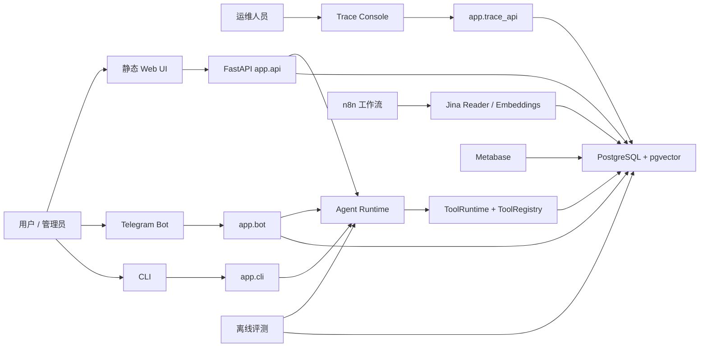

# 项目架构蓝图

生成日期：2026-05-14

本文档记录当前代码库真实呈现出来的架构，以及下一阶段建议采用的工程化边界。目标不是重写项目，而是在保留现有能力的前提下，让项目结构更清晰、更可维护，不再像功能堆叠式 Demo。

## 范围

本次蓝图覆盖以下目录：

- `app/`：FastAPI API、Trace API、Telegram Bot、本地 CLI。
- `agent/`：Agent 门面、LangGraph 运行时、工具运行时、策略、提示词、MCP 边界。
- `services/`：PostgreSQL 连接池、会话、Trace 持久化、邮件、线程记忆。
- `eval/`：任务评测、数据集生成、rerank 评测、报告、Trace 查询。
- `sql/`：schema、view、seed、分析 SQL。
- `deployment/`：Docker Compose、部署脚本、数据库脚本。
- `trace_dashboard/`：Vue 3 Trace Console。
- `frontend/`：静态 Web 对话页和订阅页。
- `tests/`：覆盖 API、Agent、工具、评测、Trace、编码守卫的单元测试。

## 总体判断

TechNews Intelligence 当前最适合被定义为一个**模块化单体**，核心边界是 Agent Runtime、数据平台、交互入口和离线评测。它还不适合过早拆成微服务，也不是简单脚本集合。

当前已经具备不少真实工程能力：

- API、Telegram、CLI、评测路径复用同一套 Agent Runtime。
- `ToolRuntime` 已经提供 Pydantic 参数校验、hooks、Trace span、证据 envelope。
- PostgreSQL 中有持久化 Trace 模型，并配套独立 Trace Console。
- 离线评测体系包含数据集、矩阵评测、rerank 评测和报告生成。
- Docker Compose、部署脚本和 CI 都已存在。

主要问题不是能力缺失，而是**边界不够清晰**：

- `app/api.py` 同时承担 HTTP adapter、认证/额度、订阅、SSE、审批签名、会话持久化和聊天编排。
- `agent/graph/nodes.py` 集中承载所有 LangGraph 节点实现。
- `eval/build_task_dataset.py` 把复杂离线管线集中在一个大文件中。
- 配置、签名、限流、流式事件格式化、运行时边界等横切关注点没有稳定归属。

## 目标架构风格

建议采用务实版 Clean Architecture / Hexagonal Architecture 的模块化单体：

```text
交互适配层        app/, frontend/, trace_dashboard/
应用流程层        app/use_cases/, eval pipelines
运行时核心层      agent/core/, agent/graph/, agent/tools/
基础设施层        services/, sql/, deployment/
可观测性          agent/core/trace.py, services/agent_trace_store.py, app/trace_api.py
```

依赖方向应尽量保持向内：

```text
frontend / Telegram / HTTP
        -> app adapters
        -> app use cases
        -> agent runtime + service ports
        -> services infrastructure adapters
        -> external systems
```

`agent/` 不应知道 FastAPI、Telegram 或前端格式。`app/` 可以依赖 `agent/` 和 `services/`，反向依赖应视为架构违规。

## 系统上下文



## 核心运行流程

```mermaid
flowchart TD
    req["用户请求"] --> adapter["交互入口适配器"]
    adapter --> history["读取会话历史"]
    history --> agentfacade["agent.generate_response_payload"]
    agentfacade --> graph["LangGraph StateGraph"]
    graph --> prepare["prepare_context"]
    prepare --> intent["intent_router"]
    intent --> selection["tool_selection"]
    selection --> worker["tool_worker"]
    worker --> policy["tool_policy"]
    policy --> runtime["ToolRuntime.execute"]
    runtime --> registry["ToolRegistry + Pydantic schemas"]
    registry --> handlers["Tool handlers"]
    handlers --> postgres["PostgreSQL views/tables"]
    runtime --> evidence["ToolEnvelope evidence"]
    evidence --> final["final_synthesizer"]
    final --> guard["output_guard"]
    guard --> persist["持久化会话 + Trace"]
    persist --> response["HTTP/SSE/Telegram 响应"]
```

## 组件职责

| 区域 | 当前职责 | 目标边界 |
| --- | --- | --- |
| `app/api.py` | HTTP 路由、认证、额度、订阅、聊天、SSE、审批链接 | 瘦 FastAPI adapter，调用 use-case 模块 |
| `app/bot.py` | Telegram adapter、HTML 格式化、管理员命令、额度检查 | Telegram 专属交互适配器，复用共享应用服务 |
| `app/trace_api.py` | Trace API 和静态 UI 服务 | Trace 管理入口 |
| `agent/agent.py` | Agent 公共门面、Trace context、输出 guard | 稳定 runtime facade，避免交互入口细节 |
| `agent/graph/builder.py` | LangGraph 拓扑 | 图节点组合根 |
| `agent/graph/nodes.py` | 所有 graph node 逻辑 | 按节点族拆分，保留 `GraphNodeRunner` 作为门面 |
| `agent/core/tool_runtime.py` | 工具执行边界 | 保持为工具执行的唯一运行时边界 |
| `agent/core/tool_catalog.py` | 工具注册元数据 | 保持为工具目录的单一事实源 |
| `agent/tools/*` | 数据库驱动的新闻工具 | 工具 adapter，输出保持 `ToolEnvelope` 兼容 |
| `services/db.py` | psycopg2 池和事务 helper | 基础设施 adapter |
| `services/conversations.py` | 会话持久化 | repository 风格服务 |
| `services/thread_memory.py` | 异步线程记忆更新 | 应用/基础设施混合点，后续可拆 |
| `services/agent_trace_store.py` | Trace 持久化 | Trace repository adapter |
| `eval/*` | 离线评测和报告 | 独立离线应用边界 |

## 当前架构优点

- `ToolEnvelope` 让工具返回具备稳定契约：`status`、`data`、`evidence`、`diagnostics`、错误字段。
- `ToolRegistry` 在 handler 执行前进行 Pydantic 校验。
- `ToolRuntime` 集中处理 pre/post hooks、进度事件、Trace 和指标。
- `agent/graph/builder.py` 明确表达 LangGraph 拓扑。
- `services/db.py` 提供事务 helper 和连接状态清理。
- API 安全测试已覆盖审批签名、跨 token 会话隔离、额度通知、限流等行为。
- Trace 是一等能力：span、模型 I/O、token usage、错误链、证据 URL 都会持久化并展示。

## 当前架构风险

### 1. 交互入口过载

`app/api.py` 超过 1,200 行，承担过多职责：

- FastAPI 路由模块。
- 请求/响应 schema 模块。
- 限流器。
- 审批链接签名和 HTML 页面渲染。
- 额度管理。
- 订阅管理。
- 聊天用例编排。
- SSE 事件格式化。
- 会话持久化协调。

这会导致新增功能时很容易触碰无关行为。

### 2. Graph 节点过度集中

`agent/graph/nodes.py` 同时包含所有 graph node 和大量 helper。图拓扑本身清晰，但节点实现文件过大，不利于审查和维护。

### 3. 离线管线文件过大

`eval/build_task_dataset.py` 是当前最大的项目自有源文件。它属于离线工具，风险低于 runtime，但最终也应按管线阶段拆分。

### 4. 缺少架构护栏

当前主要靠约定维护边界，缺少自动化测试防止核心 runtime 反向依赖交互入口。

### 5. 配置分散

环境变量解析散落在多个模块中。交互入口配置、运行时配置、基础设施配置没有统一边界。

## 目标模块边界

### 交互适配层

职责：接受外部输入，并把内部结果映射为渠道特定格式。

建议结构：

```text
app/
  api.py                 FastAPI 路由注册
  bot.py                 Telegram adapter
  cli.py                 CLI adapter
  trace_api.py           Trace 管理 API
  schemas.py             HTTP DTO
  streaming.py           SSE 事件映射
  security.py            审批签名和限流
  use_cases/
    chat.py
    subscriptions.py
    access_tokens.py
```

规则：

- 可以 import `agent` 和 `services`。
- 过渡期可保留少量 SQL glue，但目标是不把业务 SQL 写在 route 中。
- 不放提示词逻辑，不放工具逻辑。

### Agent Runtime 层

职责：理解用户意图、选择工具、执行工具、生成有证据支撑的回答、记录运行时 Trace。

建议结构：

```text
agent/
  agent.py
  graph/
    builder.py
    state.py
    routing.py
    nodes.py                过渡期门面
    context_nodes.py
    intent_nodes.py
    tool_nodes.py
    final_nodes.py
  core/
  tools/
  mcp/
```

规则：

- 不 import FastAPI、Telegram、frontend。
- 工具 handler 可依赖 `services.db`，但面向模型的输出必须通过 `ToolEnvelope`。
- 公共 runtime 入口保持稳定：`generate_response_payload`、eval payload helpers、graph invocation。

### 基础设施层

职责：连接具体外部系统。

建议结构：

```text
services/
  db.py
  conversations.py
  agent_trace_store.py
  mail.py
  llm_provider.py
  thread_memory.py
```

规则：

- 管理 PostgreSQL、SMTP、模型 provider 工厂、持久化细节。
- 不依赖 `app`。
- 如果 `agent` 需要共享接口，接口应尽量窄且明确。

### 评测层

职责：运行离线质量评估和检索评估。

建议结构：

```text
eval/
  datasets/
  config/
  reports/
  task_eval_*.py
  run_*.py
  build_*.py
```

规则：

- 可以依赖 runtime 和 services。
- API/Bot 线上运行不应依赖 eval。
- 生成产物除精选 fixture 外不入库。

## 架构治理

在大规模拆分前，先增加轻量架构测试：

```text
tests/unit/test_architecture_boundaries.py
```

初始规则：

- `agent/**` 不允许 import `app.api`、`app.bot`、`fastapi`、`telegram`。
- `services/**` 不允许 import `app.api` 或 `app.bot`。
- `eval/**` 不应被 `app/**` 或 `agent/**` 依赖。
- `app/api.py` 可以暂时依赖 `agent` 和 `services`，但后续应逐步收缩。

这些测试不是为了立即强制完美架构，而是为了防止最危险的反向依赖继续出现。

## 重构路线图

### Phase 0：建立基线

- 保留当前通过的测试作为行为基线。
- 保持公共入口稳定。
- 不把功能开发和架构重构混在一起。

### Phase 1：文档和护栏

- 增加本架构蓝图。
- 增加 ADR-0001：模块化单体和 Clean/Hexagonal 边界。
- 增加架构边界测试。
- 不改变 runtime 行为。

### Phase 2：抽离低风险横切模块

从 `app/api.py` 抽出：

- `app/schemas.py`：Pydantic DTO。
- `app/security.py`：审批签名、签名 URL 校验、确认页渲染。
- `app/rate_limit.py`：内存级限流器。
- `app/streaming.py`：SSE 事件格式化、progress/evidence payload 映射。

过渡期在 `app/api.py` 保留兼容 wrapper，直到测试迁移完成。

### Phase 3：抽离应用用例

将编排逻辑从 route handler 中移出：

- `app/use_cases/chat.py`
- `app/use_cases/subscriptions.py`
- `app/use_cases/access_tokens.py`

FastAPI route 应只负责解析请求、调用 use case、映射响应。

### Phase 4：拆分 Graph 节点族

按职责拆分 `agent/graph/nodes.py`：

- 上下文准备。
- 意图路由。
- 工具选择、规划、策略检查、执行。
- 证据归一和循环决策。
- 最终综合和输出守卫。

迁移期间保留 `GraphNodeRunner` 作为稳定门面。

### Phase 5：拆分评测数据集管线

将 `eval/build_task_dataset.py` 拆成：

- 输入和配置加载。
- 语料采样。
- 候选生成。
- 审计和重新生成。
- checkpoint。
- manifest/report 写入。

该阶段应排在 runtime 边界稳定之后。

## 测试策略

当前基线：

- `pytest tests/unit -q` 通过，336 个测试。
- Trace Dashboard `npm run build` 通过。

建议新增：

- 架构边界测试。
- `app/security.py`、`app/rate_limit.py`、`app/streaming.py` 的聚焦测试。
- 可选 PostgreSQL schema/view smoke test。
- 当前端安全加固进入范围后，增加 Markdown 渲染安全测试。

## 扩展规则

新增能力时遵循：

1. 用户交互渠道放在 `app/`。
2. Agent 推理、工具选择、工具运行时能力放在 `agent/`。
3. PostgreSQL、SMTP、模型 provider、外部系统连接放在 `services/`。
4. 质量、检索、回归评估放在 `eval/`。
5. 持久化结构变化同步更新 `sql/infrastructure/schema` 和部署脚本。
6. 新增工具必须在 `agent/core/tool_catalog.py` 注册，并返回 `ToolEnvelope`。
7. 新增架构规则应写成测试。

## 非目标

- 暂不拆微服务。
- 暂不替换 PostgreSQL 作为系统事实源。
- 暂不重写 LangGraph 编排。
- 暂不移除 n8n 采集链路。
- runtime 边界稳定前，不优先大拆 eval 管线。

