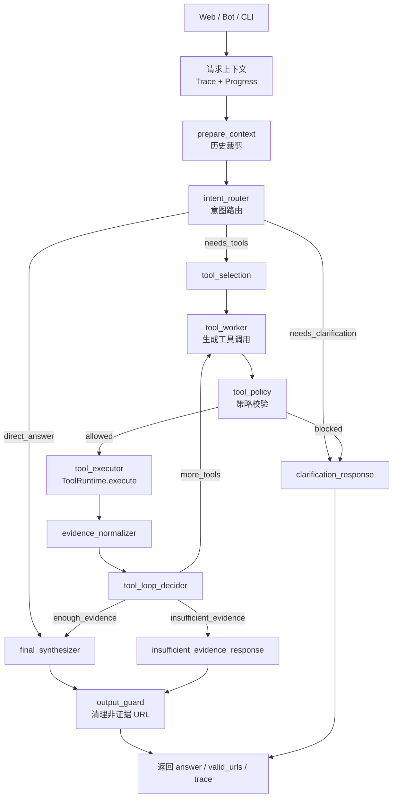
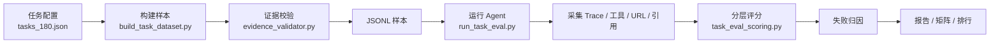

# TechNews Intelligence

TechNews Intelligence 是一个面向科技新闻的自动化情报系统。它用 n8n 定时采集 Hacker News、TechCrunch 等来源，用 Jina Reader 提取正文，用模型生成摘要、分类和情绪标签，再把结构化新闻、全文日志和向量写入 PostgreSQL。用户可以通过 Metabase、网页端、Telegram Bot、邮件日报和本地 CLI 查看数据，Agent 可以基于新闻库做检索、对比、趋势、时间线和格局分析。

这份文档是 README 的备选版本，重点放在“快速理解项目”：先看系统链路，再看 Agent、工具、评测和部署。

## 核心能力

| 能力 | 说明 |
| --- | --- |
| 新闻采集 | n8n 工作流定时采集新闻、原文、热度和元数据。 |
| 结构化处理 | LLM 生成中文标题、摘要、情绪和分类，失败记录进入死信表。 |
| 语义检索 | Jina Embeddings 写入 `news_embeddings`，结合全文、关键词和实体别名做混合检索。 |
| 智能分析 | 自定义 LangGraph Agent 支持趋势、对比、时间线、格局分析和全文读取。 |
| 多入口交互 | Web API、静态前端、Telegram Bot、本地 CLI 共用同一套 Agent 运行时。 |
| 订阅与通知 | 支持邮件日报、访问 Token、额度审批和订阅配置。 |
| 可观测性 | 请求级 Trace 记录图节点、模型调用、工具调用、保护逻辑和最终状态。 |
| 离线评测 | `eval/` 提供任务数据集构建、证据校验、分层评分、矩阵实验和排行报告。 |

## 系统架构

```mermaid
flowchart LR
    subgraph collect["采集与处理"]
        n8n["n8n 工作流"]
        reader["Jina Reader"]
        embed["Jina Embeddings"]
        llmEtl["LLM 结构化处理"]
    end

    subgraph storage["数据层"]
        db["PostgreSQL + pgvector"]
        views["Dashboard View"]
        trace["Agent Trace 表"]
    end

    subgraph app["应用入口"]
        web["静态前端"]
        api["FastAPI"]
        bot["Telegram Bot"]
        cli["本地 CLI"]
        metabase["Metabase"]
    end

    subgraph agent["Agent 分析层"]
        graph["LangGraph 编排"]
        runtime["ToolRuntime"]
        tools["新闻工具集"]
        models["Vertex / DeepSeek / Gemini"]
    end

    subgraph quality["质量体系"]
        tests["单元测试"]
        eval["任务评测"]
        reports["矩阵报告 / 排行"]
    end

    n8n --> reader --> llmEtl --> db
    n8n --> embed --> db
    db --> views --> metabase
    web --> api
    api --> graph
    bot --> graph
    cli --> graph
    graph --> runtime --> tools --> db
    graph --> models
    graph --> trace
    eval --> graph
    eval --> reports
    tests --> graph
```

## 一次 Agent 请求如何运行

实时问答由 `agent.generate_response_payload` 统一承接，评测由 `agent.generate_response_eval_payload` 复用同一套执行路径。



Agent 的核心原则是证据优先。需要新闻依据的回答必须来自工具返回的 `ToolEnvelope.evidence`；最终输出中的 URL 会被 `output_guard` 再校验一次，未出现在有效证据集合中的 URL 会被移除。

## 工具体系

工具注册和执行只有一条主路径：

```text
ToolCatalog -> ToolRegistry -> ToolRuntime -> ToolEnvelope
```

| 工具 | 用途 |
| --- | --- |
| `search_news` | 混合检索，结合语义向量、关键词、精确匹配和可选 rerank。 |
| `query_news` | 按来源、分类、情绪、排序、时间窗口等结构化查询新闻。 |
| `trend_analysis` | 对比近期窗口和前一窗口的主题热度变化。 |
| `compare_sources` | 比较不同来源对同一主题的覆盖、情绪和代表文章。 |
| `compare_topics` | 对比两个主题或实体，并隔离证据池。 |
| `build_timeline` | 按时间构建事件线。 |
| `analyze_landscape` | 分析多个实体的竞争格局、信号和证据。 |
| `fulltext_batch` | 批量读取显式 URL 或检索选中文章全文。 |
| `read_news_content` | 读取单篇新闻原文。 |
| `get_db_stats` | 查看数据库新鲜度和文章总量。 |
| `list_topics` | 查看近期每日发文分布。 |

工具调用会经过多层保护：

```mermaid
flowchart LR
    plan["模型规划工具调用"] --> policy["图内策略校验"]
    policy -->|blocked| clarify["澄清问题"]
    policy -->|allowed| schema["Pydantic 输入校验"]
    schema --> pre["运行前 Hook"]
    pre --> handler["工具处理器"]
    handler --> envelope["ToolEnvelope"]
    envelope --> post["运行后 Hook"]
    post --> graph["写回图状态"]
    graph --> output["最终输出保护"]

    schema -->|invalid| error["错误 Envelope"]
    pre -->|invalid| error
    error --> post
```

主要校验包括候选工具限制、工具数量限制、重复调用限制、schema 必填项、数值范围、URL 上下文、时间窗口、对比参数、证据完整性、空结果原因和错误码。

## 数据模型

核心数据存放在 PostgreSQL，结构由 `sql/infrastructure/schema/schema_ddl.sql` 管理。

| 分组 | 表或视图 |
| --- | --- |
| 新闻内容 | `tech_news`、`tech_news_failed`、`jina_raw_logs` |
| 检索索引 | `news_embeddings`、`news_search_index` |
| 来源治理 | `source_registry` |
| 实体治理 | `entity_registry`、`entity_alias`、`entity_alias_candidate`、`news_entity_mentions` |
| 用户与订阅 | `access_tokens`、`subscribers` |
| 会话记忆 | `conversation_threads`、`conversation_messages` |
| 可观测性 | `agent_runs`、`agent_trace_spans`、`agent_model_io` |
| 看板视图 | `view_dashboard_news` |

`view_dashboard_news` 统一处理北京时间、来源归一、Hacker News 讨论链接、搜索字段和历史数据回退，Metabase 与分析 SQL 不需要重复这些逻辑。

## 评测体系

评测不是只看最终回答，而是把一次 Agent 运行拆成意图、工具、检索、分析、生成和系统稳定性多个层级。



| 层级 | 关注点 |
| --- | --- |
| 意图层 | 是否选择了正确的回答、澄清或工具路径。 |
| 工具层 | 工具顺序、覆盖率、参数准确率、禁止工具命中。 |
| 检索层 | recall、MRR、NDCG、gold URL 命中、RCS。 |
| 分析层 | 声明支持率、无依据声明、矛盾、数值一致性。 |
| 生成层 | 可选 LLM Judge 的 faithfulness 和 relevancy。 |
| 系统层 | 超时、异常、Trace 错误和工具错误。 |

评测报告位于 `eval/reports/*`，版本化数据集位于 `eval/datasets/versions/v*/`。这些是运行产物，不应作为长期源码内容提交。

## 快速启动

### 1. 准备环境变量

```bash
cp deployment/.env.example deployment/.env
```

至少需要配置：

| 变量 | 用途 |
| --- | --- |
| `POSTGRES_USER`、`POSTGRES_PASSWORD`、`POSTGRES_DB` | PostgreSQL 连接信息。 |
| `JINA_API_KEY` | Reader、Embedding、可选 rerank。 |
| `AGENT_MODEL_PROVIDER`、`AGENT_MODEL` | 默认 Agent 模型。 |
| `AGENT_GRAPH_INTENT_PROVIDER`、`AGENT_GRAPH_TOOL_PROVIDER`、`AGENT_GRAPH_FINAL_PROVIDER` | 图内角色模型。 |
| `GEMINI_API_KEY` 或 Vertex 相关变量 | Gemini / Vertex 模型调用。 |
| `DEEPSEEK_API_KEY` | 工具规划模型调用。 |
| `TELEGRAM_BOT_TOKEN` | Telegram Bot。 |
| `SMTP_HOST`、`SMTP_USER`、`SMTP_PASS` | 邮件通知和日报。 |

### 2. 启动容器

```bash
cd deployment
docker compose up -d
```

默认服务：

| 服务 | 用途 |
| --- | --- |
| `postgres` | PostgreSQL + pgvector。 |
| `n8n` | 新闻采集和通知工作流。 |
| `metabase` | BI 看板。 |
| `api` | FastAPI 与网页聊天接口。 |
| `bot` | Telegram Bot。 |

### 3. 初始化数据库结构

```bash
bash deployment/scripts/db/apply_schema.sh
```

脚本会读取 `deployment/.env`。如果在服务器上执行，需要从仓库根目录运行，或确保脚本能定位到仓库根目录和 `deployment/.env`。

### 4. 导入 n8n 工作流

在 n8n 管理界面导入 `etl_workflow/` 下的工作流：

| 文件 | 作用 |
| --- | --- |
| `Tech_Intelligence.json` | 主采集和结构化处理流程。 |
| `System_Alert_Service.json` | 异常捕获和告警流程。 |
| `Daily_Tech_Brief.json` | 每日邮件简报流程。 |

### 5. 本地 CLI

```bash
cp agent/.env.example agent/.env
pip install -r requirements.txt
python -m app.cli
```

## 开发与验证

常用命令：

```bash
pytest tests -v
python -m eval.run_task_eval --max-cases 5
bash deployment/scripts/db/run_data_quality_checks.sh
```

CI 会安装 `requirements.txt`、运行编码检查和 `pytest tests -v`。部署工作流在 `main` 推送后通过 SSH 更新服务、重建 API/Bot 镜像并执行 `docker compose up -d --remove-orphans`。

## 目录导览

```text
agent/                 Agent 门面、LangGraph、工具运行时、工具实现、MCP 适配
app/                   FastAPI、Telegram Bot、本地 CLI
services/              数据库、会话、邮件、Trace 持久化、模型工厂
frontend/              静态聊天页和订阅页
etl_workflow/          n8n 工作流导出文件
sql/infrastructure/    schema、视图、seed、数据质量检查
sql/analytics/         Metabase 和分析查询
eval/                  数据集构建、任务评测、矩阵实验、排行报告
deployment/            Docker Compose、环境变量模板、部署脚本
tests/                 单元测试和测试辅助代码
docs/                  架构、测试和运维说明
assets/                README 图片、截图和展示资源
```

## 源码与过程产物边界

应保留并版本化：

- `agent/`、`app/`、`services/`、`eval/`、`tests/`
- `sql/`、`etl_workflow/`、`frontend/`
- `deployment/` 下的脚本、Compose 文件和 `.env.example`
- `docs/` 文档
- README 展示所需的 `assets/`

不应提交为源码：

- 真实 `.env` 和凭据文件
- `deployment/data/*`
- `eval/reports/*`
- `eval/datasets/versions/v*/`
- `tests/reports/*`
- `*.log`、`*.db`、`*.sqlite*`
- `.venv/`、`.pytest_cache/`、`.ruff_cache/`、`__pycache__/`
- 本地代理或编辑器过程目录

## 许可证

本项目采用 GNU AGPLv3 协议。
